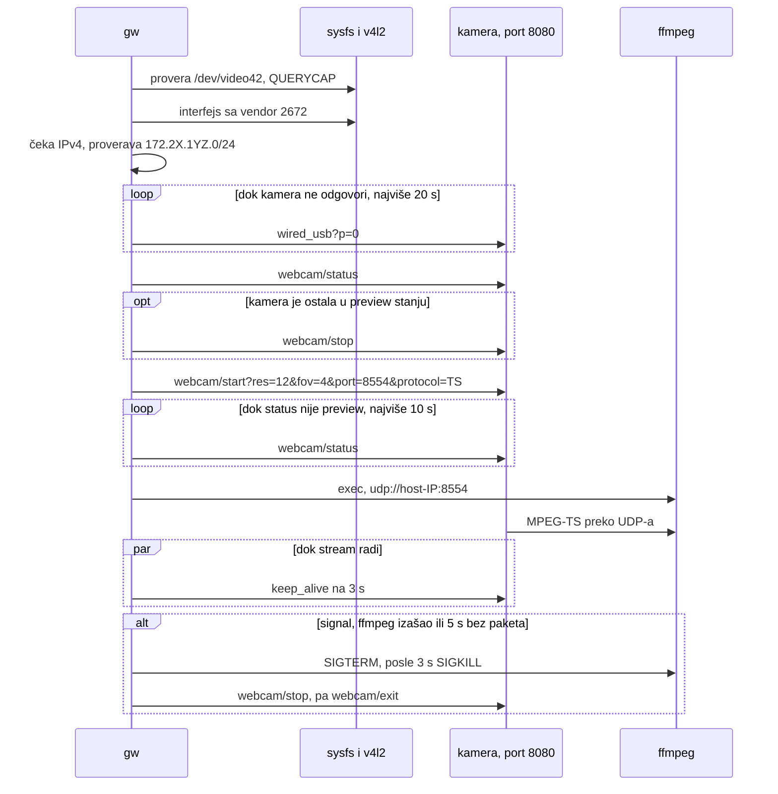

# Prvi presek: `gw start`

- **Status:** Završen 2026-10-05. Na HERO13 Black sa firmverom 02.10 `gw start` daje 1080p30 na `/dev/video42`, i svi ručni testovi su prošli (§7.1).
- **Date:** 2026-09-29
- **Owner:** Darko
- **Related:** `gopro-fork-review-and-handover.md` §4 (principi), §9 (sledeći koraci); ADR 0001 (Go kao jezik implementacije); ADR 0002 (Open GoPro HTTP API za upravljanje kamerom); `open-gopro-webcam-api.md`; `upstream-issues-review.md`

## 1. Obim

`gw start`, pokrenut ručno i bez root-a, podiže sliku sa GoPro kamere na `/dev/video42`. U obimu:

- pronalaženje GoPro interfejsa po USB vendor ID-u `2672` u sysfs-u, ili provera interfejsa zadatog sa `-iface`;
- čekanje IPv4 adrese koju hostu dodeli DHCP server kamere, i provera da je adresa u GoPro mreži `172.2X.1YZ.0/24`;
- provera da je `/dev/videoN` v4l2loopback uređaj u koji korisnik sme da piše;
- upravljanje kamerom po ADR 0002, svaki HTTP poziv sa timeout-om, i keep-alive na 3 s;
- ffmpeg kao podproces bez shell-a, koji sluša samo na adresi hosta na GoPro linku;
- SIGINT i SIGTERM: stop i exit kameri, pa gašenje ffmpeg-a.

Van obima za ovaj presek: udev pravilo, systemd servis, instalacija `modprobe.d` i NetworkManager konfiguracije, pakovanje, watchdog za pakete koji ne stižu (§8).

## 2. Komande i opcije

| Komanda | Šta radi |
|---|---|
| `gw start` | stream u v4l2loopback |
| `gw list` | ispiše GoPro interfejse: ime, USB product, sysfs putanja |
| `gw version` | verzija |

| Opcija za `start` | Podrazumevano | Provera |
|---|---|---|
| `-iface` | jedini GoPro interfejs iz sysfs-a | ime do 15 bajtova, bez `/`, `:` i razmaka, proverava se pre svega ostalog; iza njega mora biti USB uređaj sa vendor ID-em `2672` |
| `-res` | `1080` | enum: `1080`, `720`; 480p specifikacija navodi samo za HERO9 i HERO10 |
| `-fov` | `linear` | enum: `wide`, `narrow`, `superview`, `linear` |
| `-port` | `8554` | ceo broj 1024–65535 |
| `-video-nr` | `42` | ceo broj 0–255 |
| `-ffmpeg` | `ffmpeg` iz `PATH`-a | |
| `-dhcp-wait` | 30 s | pozitivno trajanje |
| `-connect-wait` | 20 s | pozitivno trajanje; koliko se čeka da HTTP server kamere odgovori |
| `-http-timeout` | 5 s | pozitivno trajanje |

## 3. Tok

Stop i exit se šalju i kad start ne uspe, jer kamera može da ostane na pola puta u webcam režimu.

## 4. Paketi

| Paket | Odgovornost |
|---|---|
| `cmd/gw` | CLI, redosled koraka, signali, keep-alive |
| `internal/usbnet` | GoPro interfejs iz sysfs-a, čekanje IPv4 adrese |
| `internal/v4l2` | `VIDIOC_QUERYCAP` nad `/dev/videoN`, drajver mora biti `v4l2 loopback` |
| `internal/camera` | Open GoPro webcam API; HTTP klijent bez proxy-ja iz okruženja i bez redirect-a, sa izvornom adresom na GoPro linku i odgovorom do 64 KiB; parsiranje `status` i `error`; adresa kamere iz adrese hosta |
| `internal/stream` | argumenti za ffmpeg, pokretanje i gašenje |

## 5. Provereno i izmereno

Na Darkovoj mašini, 2026-09-29, ffmpeg 9.0.2.

### 5.1 ffmpeg

- Za UDP ulaz ffmpeg binduje socket na adresu iz URL-a. `udp://127.0.0.2:5552`, `udp://@127.0.0.2:5551` i varijante sa `localaddr` sve slušaju na `127.0.0.2` (`ss -ulpn`). Zato `udp://<host-IP>:<port>` bez dodatnih opcija sluša samo na GoPro linku.
- Opcija `timeout` na UDP ulazu je u mikrosekundama. Kad nema streama, ffmpeg odustane posle otprilike četiri timeout-a, jer pri otvaranju ulaza čita više puta: 500 ms daje 3.3 s, 2 s daje 7.9 s. `gw` koristi 5 s.
- Opcije za početak streama, izmerene na 15 s test-streama sličnog kamerinom: H.264 1920x1080 29.97 fps `yuvj420p` 6 Mbps sa AAC-om, MPEG-TS preko UDP-a na loopback-u, oko 449 frejmova.

  | Ulazne opcije | GOP | Primljeno frejmova |
  |---|---|---|
  | bez opcija | 30 | 450 |
  | `-fflags nobuffer` | 30 | 270 |
  | `-fflags nobuffer -probesize 500000 -analyzeduration 1000000` | 30 | 420 |
  | `-flags low_delay -probesize 500000 -analyzeduration 1000000` | 30 | 450 |
  | `-fflags nobuffer -flags low_delay -analyzeduration 1000000` | 30 | 390 |
  | isto | 90 | 360 |
  | isto, uz `-probesize 500000` | 90 | 360 |

  `nobuffer` baca pakete pročitane tokom analize ulaza, umesto da ih pusti posle. Sa podrazumevanim `analyzeduration` od 5 s to je prvih 6 s, a na streamu od 6 s nijedan frejm. Bez `nobuffer` ništa se ne gubi, ali prvi frejmovi kasne za onoliko koliko je trajala analiza. `gw` koristi `-fflags nobuffer -flags low_delay -analyzeduration 1000000`: start za oko 2 s (3 s uz GOP od 90), a posle toga nema zaostatka. Na kameri treba proveriti da 1 s analize nađe parametre videa.
- Isti ulazni argumenti sa `-map 0:v:0 -vf format=yuv420p` dekodiraju ceo stream bez grešaka (izlaz `-f null`, jer v4l2loopback još nije instaliran).

### 5.2 Ostalo

- `VIDIOC_QUERYCAP` je `0x80685600`. Na `/dev/video0` (`1234:5678`) vraća drajver `uvcvideo`, i `gw` ga odbija kao izlaz.
- Interfejs se ne pogađa: `internal/usbnet` ide od `/sys/class/net/<ime>/device` naviše do prvog direktorijuma sa `idVendor`. PCI mrežna karta, drugi USB adapter i Docker bridge ne prolaze (testovi nad lažnim sysfs stablom).
- Docker mreže na ovoj mašini zauzimaju `172.17.0.0/16` do `172.31.0.0/16`. GoPro link je `/24` u istom opsegu, pa ruta ka kameri ide preko duže maske. HTTP klijent ipak postavlja izvornu adresu hosta na GoPro linku, jer kamera šalje stream na adresu sa koje je došao zahtev.
- Neispravni ulazi se odbijaju pre bilo kakve akcije: `-res 480`, `-res 'a[$(id)]'`, `-fov ultra`, `-port 80`, `-port 70000`, `-video-nr 300`, `-iface ../../etc`, višak argumenata.

## 6. Preduslovi na Darkovoj mašini

Stanje 2026-10-05, posle restarta 2026-10-04:

- Radi kernel `7.2.8-arch1-2`, isti kao paketi `linux` i `linux-headers` i jedini direktorijum u `/usr/lib/modules/`. Problem od 2026-09-29, kada je radio 7.2.6, a na disku su bili samo moduli za 7.2.7, rešen je restartom.
- `v4l2loopback-dkms` 0.15.4-2 je instaliran, a DKMS ga je preveo za 7.2.8 (`/lib/modules/7.2.8-arch1-2/updates/dkms/v4l2loopback.ko.zst`). Modul je 2026-10-05 učitan ručno sa `modprobe` (§7, korak 1); u `/etc/modprobe.d/` i `/etc/modules-load.d/` još nema konfiguracije, pa posle restarta treba ponoviti `modprobe`.
- `/dev/video42` je `root:video 0660`, a `user` dobija `rw` preko uaccess ACL-a (`getfacl`).
- NetworkManager je aktivan. Ako za GoPro interfejs sam napravi konekciju sa `ipv4.method=shared`, host dobije `10.42.0.1` i `gw` to odbije sa porukom (upstream PR #71).
- Korisnik `user` nije u grupi `video`. Za ručni rad to ne smeta: `70-uaccess.rules` daje ACL na `video4linux` uređaje korisniku na aktivnoj sesiji. Systemd servis će trebati `SupplementaryGroups=video`.
- firewalld, ufw i nftables nisu aktivni, pa dolazni UDP stiže (predajna beleška §8).

## 7. Test plan

Automatski (`go test ./...`), bez kamere:

- `usbnet`: GoPro se nalazi, ostali interfejsi ne; imena se proveravaju pre nego što uđu u putanju.
- `camera`: lažna kamera sa state machine-om iz specifikacije. Proverava tačan niz zahteva i redosled parametara, stop kad je kamera ostala u preview-u, ponavljanje dok kamera vraća 503, dekodiranje `error` koda (#28), kameru koja nikad ne krene, `HTTP_PROXY` koji se ne koristi i redirect koji se ne prati. Adresa kamere se izvodi iz adrese hosta, a `10.42.0.1`, Docker `/16` i adrese van šeme se odbijaju.
- `stream`: redosled argumenata (ulazne opcije pre `-i`); odbijanje `0.0.0.0`, multicast i IPv6 adrese; pravi ffmpeg na loopback-u izađe posle timeout-a i ugasi se na cancel.
- `v4l2`: broj ioctl-a, opseg broja uređaja.

Ručno, sa kamerom:

1. `sudo modprobe v4l2loopback video_nr=42 card_label=GoPro exclusive_caps=1`. Restart i `v4l2loopback-dkms` su urađeni 2026-10-04 (§6).
2. Kamera: Preferences → Connections → USB Connection na GoPro Connect, priključiti, `gw list`. Zapisati drajver (`readlink /sys/class/net/<ime>/device/driver`), product ID i vreme do IPv4 adrese.
3. `gw start`, pa `ffplay /dev/video42` ili `mpv av://v4l2:/dev/video42`. Zapisati da li Open GoPro endpoint-i rade na 02.10 i koliko traje do prve slike.
4. Ctrl+C: kamera izlazi iz webcam režima, ffmpeg nestaje (`pgrep ffmpeg`).
5. Isključiti kabl dok radi: `gw` izađe sa greškom u roku od nekoliko sekundi.
6. Pokrenuti `gw start` dvaput zaredom, drugi put posle `kill -9` prvog: drugi start mora da pošalje stop pre starta i da uspe.
7. Ako Open GoPro ne radi: `curl` na `http://<kamera>/gp/gpWebcam/START?res=1080` (port 80) i zapisati odgovor, za amandman ADR 0002.

### 7.1 Rezultati na kameri, 2026-10-05

HERO13 Black, `/gopro/camera/info` vraća model 65 i firmver `H24.01.02.10.00`. Kamera je bila bez microSD kartice, a USB Connection je bio na GoPro Connect.

| Korak | Rezultat |
|---|---|
| 2 | `gw list` nađe `enp0s20f0u1`, product "HERO13 Black", product ID `0059` (isti kao HERO12 Black u upstream PR #72). Drajver je `cdc_ncm`. USB veza je 480 Mb/s, iako `webcam/version` kaže `usb_3_1_compatible: true`; to zavisi od porta i kabla, a za stream od oko 6 Mb/s nije bitno. |
| 2 | NetworkManager je sam napravio "Wired connection N" sa `ipv4.method=auto`, bez gateway-a. Host je dobio `172.21.123.54/24`. Serijski broj se završava na 123, pa je kamera na `172.21.123.51`, tačno po specifikaciji. Ruta ka kameri ide preko `enp0s20f0u1`. |
| 3 | Pre starta `webcam/status` vraća `status 1` (Idle). To je quirk iz FAQ-a: posle priključenja Idle umesto Off. Start iz Idle radi. `webcam/version` vraća 4. |
| 3 | Open GoPro endpoint-i na portu 8080 rade, pa stari API nije potreban (korak 7 otpada). Od `gw start` do "webcam started" prođe 2.1 do 2.5 s, a do formata na `/dev/video42` 3.8 do 4.1 s. |
| 3 | `/dev/video42`: 1920x1080, `YU12`; 150 frejmova pročitano za 5.0 s, 29.98 fps. Snimak je oštar, boje su ispravne, linear FOV je bez fisheye efekta. |
| 3 | ffmpeg upozori da ne nalazi parametre za stream 2 (privatni `0x80`) i stream 3 (AC3 sa 0 kanala), i da je `yuvj420p` zastareo format. Oba upozorenja su očekivana (upstream #56) i ne smetaju, jer `gw` uzima samo video. |
| 4 | Posle Ctrl+C kamera prijavi `status 0` (Off), ffmpeg ne ostane, `gw` izađe sa kodom 0. Stop i exit traju oko 0.9 s. |
| 6 | Posle `kill -9` ffmpeg umre zajedno sa `gw`-om (`Pdeathsig`), a kamera nastavi da šalje (`status 2`). Sledeći `gw start` zaustavi zaostali stream i za 4.1 s daje 30 fps. |
| 5 | Kabl izvučen dok stream radi: interfejs nestane, a `gw` izađe sa kodom 1 posle 5.65 s, zbog read timeout-a od 5 s. ffmpeg ne ostane. ffmpeg je izašao sa kodom 0, pa je poruka bila samo "ffmpeg exited". Stop i exit su pali na `bind: cannot assign requested address`, jer adresa hosta više ne postoji. Ispravljeno odmah posle testa: poruka sada kaže da 5 s nema videa i pita da li je kamera isključena, a stop se preskače kad interfejs više ne postoji. Pokriveno testom `TestRunStreamStops`; isključivanje kabla posle ispravke nije ponovljeno. |

## 8. Sledeći presek

Iz `upstream-issues-review.md` §2:

- Watchdog: ako posle START-a nema paketa 3 do 5 s, ponoviti START nekoliko puta, pa prijaviti da paketi ne stižu (firewall ili VPN).
- Provera da ruta ka kameri ide preko GoPro interfejsa.
- Manje šuma u logu: upozorenja ffmpeg-a za stream 2 i 3 i za `yuvj420p` (§7.1) pojave se pri svakom startu.
- Poruka "izvuci i vrati kabl" kad interfejs postoji, a HTTP ne odgovara (#74).
- udev pravilo po vendor ID-u sa `SYSTEMD_WANTS`, `gw@.service` sa `BindsTo` i sandboxing-om, `modprobe.d` sa rezervnim uređajem za OBS, NetworkManager keyfile za GoPro interfejse.

## 9. Gde smo i šta sledi

- 2026-09-29: napisani `usbnet`, `v4l2`, `stream` i `camera`, sa testovima. Kamera se vodi preko Open GoPro API-ja (ADR 0002). Argumenti za ffmpeg su izmereni na lokalnom test-streamu (§5.1).
- 2026-10-04: restart u kernel 7.2.8 i instaliran `v4l2loopback-dkms`; 2026-10-05 provereno da se sve slaže (§6).
- 2026-10-05: ručni test na kameri, svi koraci su prošli (§7.1). Posle koraka 5 ispravljeni su poruka o kraju streama i stop kad kamera više nije priključena.
- Sledeće: prvi commit, pa sledeći presek (§8).
