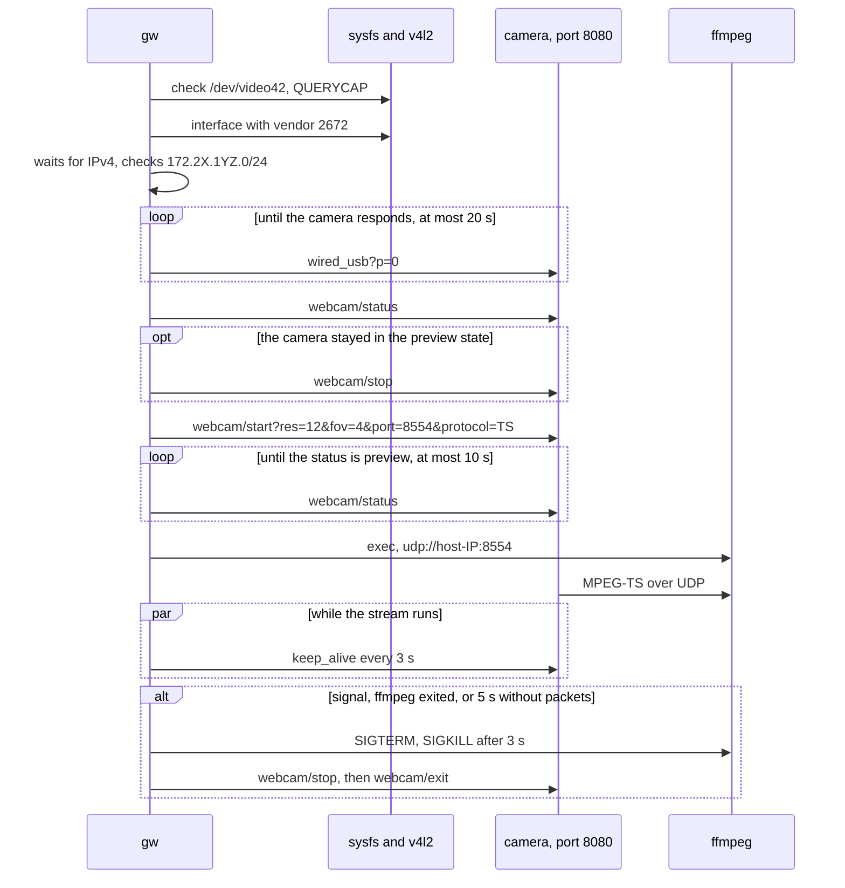

# First slice: `gw start`

- **Status:** Done 2026-10-05. On a HERO13 Black with firmware 02.10, `gw start` delivers 1080p30 on `/dev/video42`, and all manual tests passed (§7.1).
- **Date:** 2026-09-29
- **Owner:** Darko
- **Related:** `gopro-fork-review-and-handover.md` §4 (principles), §9 (next steps); ADR 0001 (Go as the implementation language); ADR 0002 (Open GoPro HTTP API for camera control); `open-gopro-webcam-api.md`; `upstream-issues-review.md`

## 1. Scope

`gw start`, run by hand and without root, brings the picture from the GoPro camera up on `/dev/video42`. In scope:

- finding the GoPro interface by USB vendor ID `2672` in sysfs, or checking the interface given with `-iface`;
- waiting for the IPv4 address that the camera's DHCP server assigns to the host, and checking that the address is in the GoPro network `172.2X.1YZ.0/24`;
- checking that `/dev/videoN` is a v4l2loopback device the user may write to;
- camera control per ADR 0002, every HTTP call with a timeout, and keep-alive every 3 s;
- ffmpeg as a subprocess without a shell, listening only on the host's address on the GoPro link;
- SIGINT and SIGTERM: send stop and exit to the camera, then shut down ffmpeg.

Out of scope for this slice: the udev rule, the systemd service, installing the `modprobe.d` and NetworkManager configuration, packaging, a watchdog for packets that do not arrive (§8).

## 2. Commands and options

| Command | What it does |
|---|---|
| `gw start` | stream into v4l2loopback |
| `gw list` | lists GoPro interfaces: name, USB product, sysfs path |
| `gw version` | version |

| Option for `start` | Default | Check |
|---|---|---|
| `-iface` | the only GoPro interface in sysfs | name up to 15 bytes, without `/`, `:` and spaces, checked before anything else; behind it there must be a USB device with vendor ID `2672` |
| `-res` | `1080` | enum: `1080`, `720`; the specification lists 480p only for HERO9 and HERO10 |
| `-fov` | `linear` | enum: `wide`, `narrow`, `superview`, `linear` |
| `-port` | `8554` | integer 1024–65535 |
| `-video-nr` | `42` | integer 0–255 |
| `-ffmpeg` | `ffmpeg` from `PATH` | |
| `-dhcp-wait` | 30 s | positive duration |
| `-connect-wait` | 20 s | positive duration; how long to wait for the camera's HTTP server to respond |
| `-http-timeout` | 5 s | positive duration |

## 3. Flow

Stop and exit are sent even when start fails, because the camera can be left halfway into webcam mode.

## 4. Packages

| Package | Responsibility |
|---|---|
| `cmd/gw` | CLI, order of steps, signals, keep-alive |
| `internal/usbnet` | GoPro interface from sysfs, waiting for the IPv4 address |
| `internal/v4l2` | `VIDIOC_QUERYCAP` on `/dev/videoN`, the driver must be `v4l2 loopback` |
| `internal/camera` | Open GoPro webcam API; HTTP client without a proxy from the environment and without redirects, with the source address on the GoPro link and responses up to 64 KiB; parsing `status` and `error`; camera address from the host address |
| `internal/stream` | ffmpeg arguments, starting and stopping |

## 5. Verified and measured

On the test machine, 2026-09-29, ffmpeg 9.0.2.

### 5.1 ffmpeg

- For UDP input, ffmpeg binds the socket to the address from the URL. `udp://127.0.0.2:5552`, `udp://@127.0.0.2:5551` and the variants with `localaddr` all listen on `127.0.0.2` (`ss -ulpn`). So `udp://<host-IP>:<port>` without extra options listens only on the GoPro link.
- The `timeout` option on UDP input is in microseconds. When there is no stream, ffmpeg gives up after about four timeouts, because it reads several times while opening the input: 500 ms gives 3.3 s, 2 s gives 7.9 s. `gw` uses 5 s.
- Options for the start of the stream, measured on a 15 s test stream similar to the camera's: H.264 1920x1080 29.97 fps `yuvj420p` 6 Mbps with AAC, MPEG-TS over UDP on loopback, about 449 frames.

  | Input options | GOP | Frames received |
  |---|---|---|
  | no options | 30 | 450 |
  | `-fflags nobuffer` | 30 | 270 |
  | `-fflags nobuffer -probesize 500000 -analyzeduration 1000000` | 30 | 420 |
  | `-flags low_delay -probesize 500000 -analyzeduration 1000000` | 30 | 450 |
  | `-fflags nobuffer -flags low_delay -analyzeduration 1000000` | 30 | 390 |
  | same | 90 | 360 |
  | same, plus `-probesize 500000` | 90 | 360 |

  `nobuffer` drops the packets read during input analysis, instead of passing them on afterward. With the default `analyzeduration` of 5 s, that is the first 6 s, and on a 6 s stream not a single frame. Without `nobuffer` nothing is lost, but the first frames are late by as long as the analysis took. `gw` uses `-fflags nobuffer -flags low_delay -analyzeduration 1000000`: start in about 2 s (3 s with a GOP of 90), and no backlog after that. On the camera, check that 1 s of analysis finds the video parameters.
- The same input arguments with `-map 0:v:0 -vf format=yuv420p` decode the whole stream without errors (output `-f null`, because v4l2loopback is not installed yet).

### 5.2 Other

- `VIDIOC_QUERYCAP` is `0x80685600`. On a regular USB camera it returns the driver `uvcvideo`, and `gw` rejects it as output.
- The interface is not guessed: `internal/usbnet` walks up from `/sys/class/net/<name>/device` to the first directory with `idVendor`. A PCI network card, another USB adapter and a Docker bridge do not pass (tests on a fake sysfs tree).
- Docker networks can take the range `172.17.0.0/16` to `172.31.0.0/16`. The GoPro link is a `/24` in the same range, so the route to the camera follows the longer mask. The HTTP client still sets the host's source address on the GoPro link, because the camera sends the stream to the address the request came from.
- Invalid inputs are rejected before any action: `-res 480`, `-res 'a[$(id)]'`, `-fov ultra`, `-port 80`, `-port 70000`, `-video-nr 300`, `-iface ../../etc`, extra arguments.

## 6. Prerequisites on the test machine

State as of 2026-10-05, after the reboot on 2026-10-04:

- The running kernel must match the installed `linux` and `linux-headers` packages and the modules in `/usr/lib/modules/`. After a kernel upgrade and before a reboot, new modules cannot be loaded; that was the case on 2026-09-29, and a reboot fixed it.
- `v4l2loopback-dkms` 0.15.4-2 is installed, and DKMS built it for the running kernel. The module was loaded by hand with `modprobe` on 2026-10-05 (§7, step 1); there is no configuration in `/etc/modprobe.d/` and `/etc/modules-load.d/` yet, so `modprobe` has to be repeated after a reboot.
- `/dev/video42` is `root:video 0660`, and the user on the active session gets `rw` through the uaccess ACL (`getfacl`).
- NetworkManager is active. If it creates a connection for the GoPro interface on its own with `ipv4.method=shared`, the host gets `10.42.0.1` and `gw` rejects it with a message (upstream PR #71).
- The user is not in the `video` group. For manual use that does not matter: `70-uaccess.rules` gives the user on the active session an ACL on `video4linux` devices. The systemd service will need `SupplementaryGroups=video`.
- firewalld, ufw and nftables are not active, so incoming UDP arrives (handover note §8).

## 7. Test plan

Automated (`go test ./...`), without the camera:

- `usbnet`: the GoPro is found, other interfaces are not; names are checked before they go into a path.
- `camera`: a fake camera with the state machine from the specification. It checks the exact sequence of requests and the order of parameters, stop when the camera stayed in preview, retrying while the camera returns 503, decoding the `error` code (#28), a camera that never starts, an `HTTP_PROXY` that is not used, and a redirect that is not followed. The camera address is derived from the host address, and `10.42.0.1`, Docker `/16` and addresses outside the scheme are rejected.
- `stream`: argument order (input options before `-i`); rejecting `0.0.0.0`, multicast and IPv6 addresses; a real ffmpeg on loopback exits after the timeout and shuts down on cancel.
- `v4l2`: the ioctl number, the device number range.

Manual, with the camera:

1. `sudo modprobe v4l2loopback video_nr=42 card_label=GoPro exclusive_caps=1`. The reboot and the `v4l2loopback-dkms` installation were done on 2026-10-04 (§6).
2. Camera: Preferences → Connections → USB Connection set to GoPro Connect, plug in, `gw list`. Record the driver (`readlink /sys/class/net/<name>/device/driver`), the product ID and the time until the IPv4 address.
3. `gw start`, then `ffplay /dev/video42` or `mpv av://v4l2:/dev/video42`. Record whether the Open GoPro endpoints work on 02.10 and how long it takes until the first picture.
4. Ctrl+C: the camera leaves webcam mode, ffmpeg goes away (`pgrep ffmpeg`).
5. Unplug the cable while it runs: `gw` exits with an error within a few seconds.
6. Run `gw start` twice in a row, the second time after `kill -9` of the first: the second start must send stop before start and succeed.
7. If Open GoPro does not work: `curl` to `http://<camera>/gp/gpWebcam/START?res=1080` (port 80) and record the response, for an amendment to ADR 0002.

### 7.1 Results on the camera, 2026-10-05

HERO13 Black, `/gopro/camera/info` returns model 65 and firmware `H24.01.02.10.00`. The camera had no microSD card, and USB Connection was set to GoPro Connect.

| Step | Result |
|---|---|
| 2 | `gw list` finds the camera's interface (the name depends on the USB port, for example `enp0s20f0u1`), product "HERO13 Black", product ID `0059` (the same as the HERO12 Black in upstream PR #72). The driver is `cdc_ncm`. The USB link is 480 Mb/s, although `webcam/version` says `usb_3_1_compatible: true`; that depends on the port and the cable, and does not matter for a stream of about 6 Mb/s. |
| 2 | NetworkManager created a connection on its own ("Wired connection N") with `ipv4.method=auto`, without a gateway. The host got `.54` and the camera is on `.51`, exactly per the specification; example for a serial number ending in 123: host `172.21.123.54/24`, camera `172.21.123.51`. The route to the camera goes through the GoPro interface. |
| 3 | Before start, `webcam/status` returns `status 1` (Idle). That is the quirk from the FAQ: Idle instead of Off after plugging in. Start from Idle works. `webcam/version` returns 4. |
| 3 | The Open GoPro endpoints on port 8080 work, so the old API is not needed (step 7 is dropped). From `gw start` to "webcam started" takes 2.1 to 2.5 s, and to the format on `/dev/video42` 3.8 to 4.1 s. |
| 3 | `/dev/video42`: 1920x1080, `YU12`; 150 frames read in 5.0 s, 29.98 fps. The picture is sharp, the colors are correct, linear FOV has no fisheye effect. |
| 3 | ffmpeg warns that it cannot find parameters for stream 2 (private `0x80`) and stream 3 (AC3 with 0 channels), and that `yuvj420p` is a deprecated format. Both warnings are expected (upstream #56) and do no harm, because `gw` takes only the video. |
| 4 | After Ctrl+C the camera reports `status 0` (Off), no ffmpeg is left behind, `gw` exits with code 0. Stop and exit take about 0.9 s. |
| 6 | After `kill -9`, ffmpeg dies together with `gw` (`Pdeathsig`), and the camera keeps sending (`status 2`). The next `gw start` stops the leftover stream and delivers 30 fps in 4.1 s. |
| 5 | Cable pulled while the stream runs: the interface disappears, and `gw` exits with code 1 after 5.65 s, because of the 5 s read timeout. No ffmpeg is left behind. ffmpeg exited with code 0, so the message was only "ffmpeg exited". Stop and exit failed on `bind: cannot assign requested address`, because the host address no longer exists. Fixed right after the test: the message now says there has been no video for 5 s and asks whether the camera was unplugged, and stop is skipped when the interface no longer exists. Covered by the test `TestRunStreamStops`; unplugging the cable after the fix was not repeated. |

### 7.2 Zoom and latency, 2026-10-05

**Zoom does not see the camera until it is restarted.** Without `gw` running, `/dev/video42` reports only "Video Output", because the module is loaded with `exclusive_caps=1`. While ffmpeg writes, it reports "Video Capture", and when ffmpeg exits, it goes back to "Video Output". The kernel sends no udev event for this change (`udevadm monitor --kernel --udev --subsystem-match=video4linux` saw nothing). Zoom scans devices at startup, so it sees the camera only if `gw` was already running when Zoom started.

**Latency.** In Zoom's preview the latency was several seconds, much more than with a regular USB camera. Measurements:

| What | How | Result |
|---|---|---|
| the ffmpeg part of `gw` | local test stream (H.264 1080p30 over UDP); wall-clock time of every frame at the sender and the receiver, matched by PTS (`showinfo`, `-loglevel +datetime`) | 70 ms with `gw`'s options; 570 ms without `-flags low_delay`, because the decoder on 32 cores uses frame threading; with no options at all the first frames are 4.6 s late |
| the whole chain to the screen | GoPro pointed at an ffplay window with a clock in milliseconds; a screenshot (`grim`) shows the real clock and the clock through the camera in an ffplay window on `/dev/video42` | 1.02 to 1.07 s over five screenshots; linear, 1080p |
| Zoom | | not measured; Zoom was not in the screenshot |

The same measurement method, repeated later on 2026-10-05 with the new `gw run`/`gw start` (frames through a pipe in `gw`, §8), one screenshot per setting:

| Path | Setting | Latency |
|---|---|---|
| `gw` → `/dev/video42` → ffplay | linear 1080p | 1.12 s (old `gw`: 1.13 s) |
| same | wide 1080p | 0.97 s |
| same | narrow 1080p | 1.03 s |
| same | superview 1080p | 1.15 s |
| same | linear 720p | 1.20 s |
| same | wide 720p | 1.12 s |
| camera → ffplay directly, TS over UDP, without `gw` | linear 1080p | 0.25 s |
| camera → ffplay directly, `protocol=RTSP` | linear 1080p | 0.18 s |
| camera → ffplay directly, `webcam/preview` | | 0.18 s |

Conclusion: the camera is fast, close to GoPro's 210 ms, and FOV and resolution do not change much. **The path through `gw` adds about 0.8 s**: ffmpeg in `gw`, v4l2loopback or the reader of `/dev/video42`. The earlier estimate that it was the camera was wrong; the local 70 ms test measured only decoding, without the path through v4l2. The pipe in the new `gw` changes nothing: the old and new paths give the same result. The cause was found the same day: ffmpeg's default CFR mode for output to `v4l2` and `rawvideo` held frames for about 0.85 s. With `-fps_mode passthrough`, the latency through `gw` is 0.18 s, and in Zoom too (`second-slice-gw-run.md` §4).

## 8. Next slice

From `upstream-issues-review.md` §2:

- Watchdog: if there are no packets for 3 to 5 s after START, repeat START a few times, then report that packets are not arriving (firewall or VPN).
- A check that the route to the camera goes through the GoPro interface.
- A placeholder frame ("camera not connected") in `/dev/video42` while there is no camera, in the same format as the stream. That way the device is always "Video Capture", and Zoom sees it without a restart (§7.2). This comes with `gw` as a long-running service. Moved to `second-slice-gw-run.md` and ADR 0003.
- Latency: measure wide and linear FOV, 720p and `protocol=RTSP`, and how much Zoom adds (§7.2).
- Less noise in the log: ffmpeg's warnings for streams 2 and 3 and for `yuvj420p` (§7.1) appear on every start.
- A message "unplug and replug the cable" when the interface exists but HTTP does not respond (#74).
- `modprobe.d` with a spare device for OBS, a NetworkManager keyfile for GoPro interfaces. Instead of a udev rule with `SYSTEMD_WANTS` and a system `gw@.service`, there will be a user service that waits for the camera on its own (ADR 0003).

## 9. Where we are and what is next

- 2026-09-29: wrote `usbnet`, `v4l2`, `stream` and `camera`, with tests. The camera is controlled through the Open GoPro API (ADR 0002). The ffmpeg arguments were measured on a local test stream (§5.1).
- 2026-10-04: reboot after the kernel upgrade, and `v4l2loopback-dkms` installed; 2026-10-05 verified that everything matches (§6).
- 2026-10-05: manual test on the camera, all steps passed (§7.1). After step 5, the end-of-stream message and the stop when the camera is no longer connected were fixed.
- Next: the first commit, then the next slice (§8).
