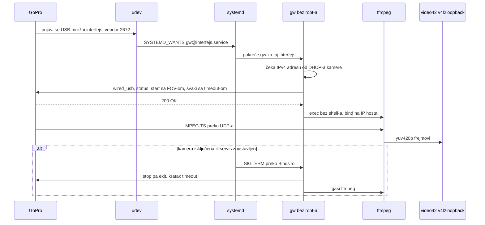

# GoPro webcam na Linuxu: nalazi iz review-a forka i predaja

- **Status:** Radna beleška, ažurirana 2026-10-05. Od 2026-10-05 program se zove `gpwebcam` (ADR 0005); ova beleška i stariji dokumenti ga zovu `gw`. Piše se od nule, u Go-u (ADR 0001), a kamerom se upravlja preko Open GoPro API-ja (ADR 0002). Prvi presek `gw start` radi na kameri: 1080p30 na `/dev/video42` (§9).
- **Date:** 2026-09-29
- **Owner:** Darko
- **Related:** ADR 0001 (Go kao jezik implementacije); ADR 0002 (Open GoPro HTTP API za upravljanje kamerom); `first-slice-gw-start.md`; `open-gopro-webcam-api.md`; `upstream-issues-review.md`; fork `darkodemic/gopro_as_webcam_on_linux` (lokalno `~/Projects/gopro_as_webcam_on_linux`, do 2026-09-29 `gopro-tux`); upstream `jschmid1/gopro_as_webcam_on_linux`

Ova beleška zamenjuje prenos sesije. Nova sesija u `~/Projects/gw` počinje čitanjem ovog fajla.

## 1. Zašto od nule

Review forka urađen je 2026-09-29, na commit-u `45adee7`. Suština alata je mala: tri HTTP poziva ka kameri, jedna ffmpeg komanda i jedan kernel modul. Problemi su u strukturi: sve radi kao root, interfejs se nagađa, a udev i systemd deo su loše postavljeni. Popravka bi dirala skoro svaku funkciju. Vredno je znanje iz §2 i lekcije iz §3, a ne kod.

Kod se ne kopira. Upstream je pod Apache 2.0, pa bi kopirani delovi nosili obaveze licence (napomene o izmenama, NOTICE). `gw` se piše od nule, na osnovu ponašanja kamere i zvanične specifikacije.

## 2. Šta znamo o kameri

Izvori su stari skript `gopro` i README iz forka, Open GoPro specifikacija (`open-gopro-webcam-api.md`) i upstream issue-i (`upstream-issues-review.md`), sve pročitano 2026-09-29. Na Darkovoj kameri je 2026-10-05 provereno ono što je označeno sa "provereno" (`first-slice-gw-start.md` §7.1).

| Stavka | Vrednost | Izvor |
|---|---|---|
| USB | vendor ID `2672` kod svih modela; product string se razlikuje ("HERO8 BLACK", "GoPro HERO9", "HERO10 Black"); HERO12 Black ima product ID `0059` | `60-gopro.rules`, upstream #15, #17, #24, PR #72 |
| USB režim na kameri | GoPro Connect, ne MTP (Preferences → Connections → USB Connection) | README; upstream #9, #52, #65 |
| USB mrežni protokol | NCM, na hostu drajver `cdc_ncm`; HERO13 Black ima product ID `0059` | Open GoPro; provereno |
| Mreža | kamera je DHCP server na `172.2X.1YZ.51`, gde je XYZ poslednje tri cifre serijskog broja; host dobije `.52` do `.54` u istoj /24 mreži | Open GoPro; upstream #30; provereno (`172.21.123.51`, host `.54`) |
| Kontrola | HTTP bez autentifikacije na portu 8080 (Open GoPro) ili 80 (stari endpoint-i) | ADR 0002 |
| Webcam API | `/gopro/webcam/{start,stop,exit,status}`; `start?res=12&fov=4&port=8554&protocol=TS`, parametri tim redom | Open GoPro, ADR 0002; provereno na 02.10 |
| Rezolucija | `res` 7 = 720p, 12 = 1080p; 4 = 480p samo HERO9 i HERO10 | Open GoPro |
| FOV | wide 0, narrow 2, superview 3, linear 4, isto u oba API-ja | Open GoPro setting 43; upstream #77 |
| Stari API | `/gp/gpWebcam/START?res=1080`, `SETTINGS?fov=`, `STOP`, `EXIT` na portu 80; nedokumentovan, po prijavama radi i na HERO13 | upstream #77 |
| Odgovor | `{"status":N,"error":N}`; status 0 Off, 1 Idle, 2 i 3 stream radi, 4 unavailable; error 0 znači uspeh. Posle priključenja status je Idle, posle stop i exit Off | Open GoPro; upstream #28; provereno |
| Preduslovi | `wired_usb?p=0` pre webcam komandi; `keep_alive` na 3 s | Open GoPro |
| Stream | unicast MPEG-TS preko UDP-a na adresu sa koje je stigao start, podrazumevano port 8554; H.264 1920x1080 29.97 fps uz AAC, prazan AC3 i privatni stream `0x80` | Open GoPro; upstream #56 |
| Ograničenja | najviše 1080p30, bez zvuka i stabilizacije, oko 6 Mbps; kašnjenje najmanje 210 ms po GoPro-u, izmereno 500 do 700 ms | Open GoPro FAQ; upstream #46 |
| Modeli | HERO8 do HERO13 sa starim API-jem; trenutna Open GoPro specifikacija za webcam navodi samo HERO13 Black | README; Open GoPro |
| Darkova kamera | HERO13 Black, model 65, firmver `H24.01.02.10.00` (u Camera Info piše "02.10"; isto vraća `/gopro/camera/info`) | 02.10.00 od 2025-10-14 je najnovija verzija u KonradIT/gopro-firmware-archive, provereno 2026-09-29 |

HERO13 sa prvim firmverom v01.10.00 vraćao je HTTP 500 na webcam start; GoPro kaže da je to ispravljeno (Open GoPro FAQ, issue #603).

## 3. Nalazi iz review-a: šta ne ponoviti

Provereno 2026-09-29 na commit-u `45adee7`. Linije se odnose na fajl `gopro` u forku.

### 3.1 Bezbednost

1. **ffmpeg radi kao root i sluša na svim interfejsima.** `udp://@0.0.0.0:8554` (`gopro:415`) prima stream od bilo koga na LAN-u ili Wi-Fi-ju. Najmanje što napadač može je da ubaci svoju sliku u kameru, a bug u ffmpeg parseru mu daje root. README još savetuje da se port otvori u podrazumevanoj zoni firewall-a.
2. **Ceo skript traži root** (`gopro:455`), iako root treba samo za `modprobe`. Ulaz se ne proverava:
   - `-r` ide u `[[ $x -ne 1080 ]]` (`gopro:130`), gde bash računa aritmetiku i izvršava kod iz argumenta. Dokazano: `./gopro version -r 'a[$(echo INJECTED-AS-$(id -un) >&2)]'` je tri puta ispisao `INJECTED-AS-darko`.
   - `-c` ulazi neizmenjen u ffmpeg filtergraph (`gopro:413`).
   - `--video-number` se deli na reči i lepi u `modprobe` (`gopro:128`, `gopro:280`).
   - `-` radi `cat $2` kao root (`gopro:239`), a rezultat se ne koristi.
3. **`modprobe -rf v4l2loopback` pri svakom startu** (`gopro:52`, `gopro:305`). Darkov kernel ima `CONFIG_MODULE_FORCE_UNLOAD=y`, pa `-f` zaista izbacuje modul koji se koristi, a gase se i drugi v4l2loopback uređaji (OBS Virtual Camera). Servis ima `Restart=on-failure`, `RestartSec=15s` i `WantedBy=multi-user.target`. Ako je uključen, a kamera nije priključena, skript na svakih 15 sekundi izbaci modul i pošalje HTTP GET na `.51` u mreži pogrešno pogođenog interfejsa.

### 3.2 Bagovi

- `-n` je definisan dvaput (`gopro:192`, `gopro:230`), pa `-n 43` ne menja video uređaj. Proveren.
- `-f:v mpegts -fflags nobuffer` stoje posle `-i` (`gopro:415`), pa važe za izlaz, a ne za ulaz. Opcije za nisku latenciju ne rade.
- `fifo_size=50000000`: jedinica je paket od 188 bajtova, što je oko 9.4 GB bafera. Podrazumevana vrednost je 28672 (`ffmpeg -h protocol=udp`, ffmpeg 9.0.2).
- `test_DEPS` se nikad ne poziva (`gopro:260`).
- `card_label='GoPro'`: navodnici ostaju deo imena, jer se komanda izvršava kao `${module_cmd}`.
- Interfejs se bira kao "poslednji aktivan" (`gopro:321`), što promaši uz Docker, VPN ili libvirt.
- curl nema timeout (`gopro:367`, `gopro:380`). Nema STOP-a ni `trap`-a, pa kamera ostaje u webcam modu posle izlaska.

### 3.3 udev i systemd

- Pravilo prepoznaje samo product `GoPro HERO9`, a README kaže HERO8.
- Pravilo za `remove` koristi `ATTRS`, a oni se posle isključenja više ne mogu pročitati, pa se verovatno nikad ne okine.
- `RUN+="systemctl start ..."` umesto `TAG+="systemd"` i `ENV{SYSTEMD_WANTS}`.
- README kaže da se pravilo kopira u `/lib/udev/rules.d/` (direktorijum paketa), a lokalna pravila idu u `/etc/udev/rules.d/`.
- Servis nema nikakav sandboxing.

## 4. Principi za gw

1. **Root samo pri instalaciji.** Modul se učitava preko `/etc/modules-load.d/` i `/etc/modprobe.d/` (`video_nr`, `card_label`, `exclusive_caps=1`). U radu nema root-a, a modul se nikad ne izbacuje.
2. **Nema nagađanja.** Ime interfejsa dolazi od udev-a (vendor ID `2672`) ili se traži po vendor ID-u u sysfs-u.
3. **ffmpeg bez shell-a.** Pokreće se kao lista argumenata i sluša samo na IP adresi hosta na GoPro interfejsu.
4. **Stroga provera ulaza.** Rezolucija i FOV su enum, port i broj uređaja su brojevi u opsegu, crop su četiri broja.
5. **Timeout na svakom HTTP pozivu.** Na SIGTERM se šalje STOP kameri i gasi ffmpeg.
6. **Ne dirati tuđe v4l2loopback uređaje** (OBS i slični).

## 5. Predloženi tok

## 6. Otvorene odluke

| Pitanje | Opcije | Preporuka |
|---|---|---|
| Jezik | Go, Python, bash | Odlučeno 2026-09-29: Go, ADR 0001 (Go kao jezik implementacije) |
| Kontrolni API | Open GoPro `/gopro/webcam/*`, stari `/gp/gpWebcam/*`, oba | Odlučeno 2026-09-29: Open GoPro, stari kao rezerva posle testa na kameri; ADR 0002 (Open GoPro HTTP API za upravljanje kamerom) |
| Transport streama | UDP TS, RTSP (`protocol=RTSP`, samo HERO12+) | UDP TS za početak; RTSP izmeriti na kameri, jer zaobilazi firewall |
| Video pipeline | ffmpeg kao spoljni proces, GStreamer | ffmpeg, jer je dokazano da radi sa ovim streamom |
| v4l2loopback uređaj | statički preko `modprobe.d`, dinamički preko `v4l2loopback-ctl add` u novijim verzijama | statički za početak |
| Model za testiranje | HERO13 Black, firmver 02.10 | Poznato 2026-09-29; prvo se cilja ovaj model |
| Pakovanje | PKGBUILD (AUR), install skript | kasnije |
| Licenca | ? | otvoreno |

## 7. Upstream kao baza znanja

Stanje proveravano 2026-09-29 kroz `gh`: 61 issue (36 otvorenih), poslednji push 2026-03-04. Svi su pročitani 2026-09-29; nalazi i zahtevi za `gw` su u `upstream-issues-review.md`. Otvoreni PR-ovi:

- #82: system tray GUI
- #81: v4l2loopback modul u upotrebi
- #80: uputstvo za nisku latenciju uz OBS
- #79: DHCP discovery na GoPro interfejsu
- #76: nepouzdan start preko udev-a
- #72: instalacija servisa i udev pravila
- #71: popravka NetworkManager konekcije

Issue-i su najbolji spisak problema po modelima i verzijama firmvera.

## 8. Okruženje na Darkovoj mašini

Provereno 2026-09-29:

- Arch Linux, kernel `7.2.6-arch2-1`, `CONFIG_MODULE_FORCE_UNLOAD=y`
- Instaliran je kernel `7.2.7-arch1-1` i samo njegovi moduli postoje u `/usr/lib/modules/`, pa se novi moduli (USB mrežni drajver kamere, v4l2loopback) ne mogu učitati do restarta. Rešeno 2026-10-04: restart u `7.2.8-arch1-2` (stanje ispod)
- ffmpeg 9.0.2, curl 8.22.0, Go 1.26.8
- `v4l2loopback` modul nije instaliran: `v4l2loopback-dkms` 0.15.4-2 je u `extra`, a `linux-headers` 7.2.7 su instalirani; VLC nije instaliran

Provereno 2026-10-05: radi kernel `7.2.8-arch1-2`, isti kao `linux`, `linux-headers` i `/usr/lib/modules/`. `v4l2loopback-dkms` 0.15.4-2 je instaliran i preveden za 7.2.8, ali modul nije učitan i nema konfiguracije u `/etc/modprobe.d/`.
- NetworkManager je aktivan; Docker bridge-evi zauzimaju `172.17.0.0/16` do `172.31.0.0/16`
- Korisnik `user` nije u grupi `video`; pristup v4l2 uređajima dobija preko `uaccess` ACL-a na aktivnoj sesiji
- Postojeća kamera `/dev/video0` je UVC (`1234:5678`)
- firewalld, ufw i nftables nisu aktivni
- shellcheck postoji samo kao mise shim bez podešene verzije

## 9. Gde smo i šta sledi

- 2026-09-29: review forka završen, napravljen `~/Projects/gw` sa ovom beleškom.
- 2026-09-29: fork preimenovan u `darkodemic/gopro_as_webcam_on_linux`, na GitHub-u i lokalno, i `origin` pokazuje na novo ime. Služi samo kao referenca.
- 2026-09-29: `gw` je git repo sa granom `main`, još bez commit-a. Jezik je Go, ADR 0001 (Go kao jezik implementacije).
- 2026-09-29: pročitana Open GoPro specifikacija (`open-gopro-webcam-api.md`) i svi upstream issue-i i PR-ovi (`upstream-issues-review.md`). Kontrolni API je Open GoPro, ADR 0002.
- 2026-09-29: napisan prvi presek `gw start` (`first-slice-gw-start.md`): Go modul `github.com/darkodemic/gw`, paketi `usbnet`, `v4l2`, `camera` i `stream`, testovi prolaze. ffmpeg argumenti su izmereni na lokalnom test-streamu.
- 2026-10-04: restart u kernel 7.2.8, instaliran `v4l2loopback-dkms`.
- 2026-10-05: `gw start` radi na kameri: 1080p30 na `/dev/video42` za oko 4 s; Ctrl+C vraća kameru u Off; posle `kill -9` sledeći start sam zaustavi zaostali stream; posle izvlačenja kabla `gw` izađe za oko 5.7 s (`first-slice-gw-start.md` §7.1).

- 2026-10-05: prvi commit `775cf97` na `main`. Napisan `README.md` (opis, build, podešavanje, upotreba, rešavanje problema); čeka Darkove izmene pre commit-a.
- 2026-10-05: Zoom ne vidi kameru ako je pokrenut pre `gw`-a; rešenje je `gw` kao jedini pisac u uređaj sa zamenskom slikom i `gw run` kao user servis (ADR 0003, `second-slice-gw-run.md`). Merenje kašnjenja: kamera direktno 0.25 s, kroz `gw` oko 1.1 s (`first-slice-gw-start.md` §7.2).
- 2026-10-05: kašnjenje kroz `gw` spušteno sa 1.1 s na 0.18 s (`-fps_mode passthrough`); watchdog za kameru koja posle START-a ne šalje video; Zoom prolazi izvlačenje i vraćanje kabla bez restarta (`second-slice-gw-run.md` §3.1, §4).

- 2026-10-05: licenca Apache-2.0 (ADR 0004); ime `gpwebcam`, paketi kroz GoReleaser i podešavanje modula kroz `/usr/lib/modprobe.d` (ADR 0005, `packaging-and-release.md`).

Sledeće:

1. Instalacija lokalno napravljenog paketa i test servisa (`packaging-and-release.md` §7). Servis pod systemd-om i README za `gw run` (`second-slice-gw-run.md` §5). Kašnjenje je rešeno 2026-10-05: 0.18 s u Zoom-u (`-fps_mode passthrough`, `second-slice-gw-run.md` §4).
2. Ostatak iz `first-slice-gw-start.md` §8: watchdog za pakete, provera rute, instalacija.

## 10. Ideje za kasnije

Predložio Darko 2026-10-05. Još nisu planirane ni odlučene.

### 10.1 Notifikacije na desktopu

Obaveštenje kad se kamera priključi, kad stream krene i kad se kamera isključi ili stream nestane. Uz to i greške koje korisnik može da popravi: nema IP adrese, pogrešna mreža, ne stižu paketi.

- Standard je `org.freedesktop.Notifications` na session D-Bus-u. Na Darkovoj mašini ga pruža Quickshell, a postoje i `notify-send` i `gdbus` (provereno 2026-10-05).
- Go standardna biblioteka nema D-Bus. Opcije su:
  - `notify-send` preko `os/exec`, sa listom argumenata i bez shell-a;
  - `github.com/godbus/dbus/v5`, prva spoljna zavisnost;
  - sopstveni minimalni D-Bus klijent, što je verovatno previše posla.
- Session bus postoji samo za korisnika, pa ovo radi ako `gw` radi kao systemd user servis, a ne kao sistemski. To se slaže sa principom "bez root-a u radu" (§4). Treba proveriti da li udev može da pokrene user servis preko `ENV{SYSTEMD_USER_WANTS}`.

### 10.2 Snimanje

`gw record` ili opcija uz `start` koja snima stream kamere u fajl.

- Snima se H.264 stream sa kamere bez ponovnog kodiranja (`-map 0:v:0 -c copy`), a ne dekodirani frejmovi sa `/dev/video42`. Tako nema gubitka kvaliteta, a procesor skoro ne radi. Snimci iz testa od 2026-10-05 išli su preko `/dev/video42` samo zato što je to bila provera uređaja.
- Webcam i snimanje mogu istovremeno iz jednog ffmpeg-a sa dva izlaza: dekodirano u v4l2loopback i kopija u fajl. Postoje i `tee` muxer i dva izlaza sa `-map`.
- Kontejner je Matroska (`.mkv`), jer ostaje čitljiv i kad snimanje prekine izvučen kabl. Običan MP4 tada nema `moov` atom i ne može da se pusti; alternativa je fragmentisan MP4. ffmpeg 9.0.2 ima `matroska`, `mp4` i `mpegts` muxere.
- Oko 6 Mb/s je oko 2.7 GB na sat. Webcam režim nema zvuk (§2), pa snimak nema zvuk.
- Snimanje na microSD karticu kamere je druga stvar (preset-i i shutter preko Open GoPro API-ja), i nije deo webcam režima.

