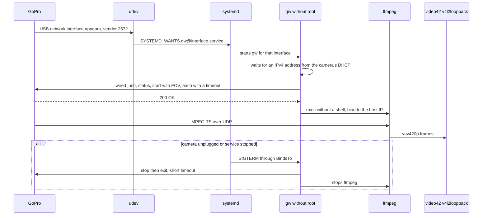

# GoPro webcam on Linux: fork review findings and handover

- **Status:** Working note, updated 2026-10-06. Since 2026-10-05 the program is called `gpwebcam` (ADR 0005); this note and older documents call it `gw`. It is written from scratch, in Go (ADR 0001), and the camera is controlled through the Open GoPro API (ADR 0002). Tag `v0.1.0` on 2026-10-06 (`release-0.1.0.md`); next is 0.2.0 with a tray icon and recording (`tray-and-recording.md`, §9).
- **Date:** 2026-09-29
- **Owner:** Darko
- **Related:** ADR 0001 (Go as the implementation language); ADR 0002 (Open GoPro HTTP API for camera control); `first-slice-gw-start.md`; `open-gopro-webcam-api.md`; `upstream-issues-review.md`; fork `darkodemic/gopro_as_webcam_on_linux` (locally `~/Projects/gopro_as_webcam_on_linux`, `gopro-tux` until 2026-09-29); upstream `jschmid1/gopro_as_webcam_on_linux`

This note replaces a session handover. A new session in `~/Projects/gpwebcam` (`~/Projects/gw` until 2026-10-05) starts by reading this file.

## 1. Why from scratch

The fork was reviewed on 2026-09-29, at commit `45adee7`. The core of the tool is small: three HTTP calls to the camera, one ffmpeg command and one kernel module. The problems are in the structure: everything runs as root, the interface is guessed, and the udev and systemd parts are set up badly. A fix would touch almost every function. What has value is the knowledge in §2 and the lessons in §3, not the code.

No code is copied. Upstream is under Apache 2.0, so copied parts would carry license obligations (change notices, NOTICE). `gw` is written from scratch, based on the camera's behavior and the official specification.

## 2. What we know about the camera

The sources are the old `gopro` script and the README from the fork, the Open GoPro specification (`open-gopro-webcam-api.md`) and the upstream issues (`upstream-issues-review.md`), all read on 2026-09-29. What is marked "verified" was verified on the test camera on 2026-10-05 (`first-slice-gw-start.md` §7.1).

| Item | Value | Source |
|---|---|---|
| USB | vendor ID `2672` on all models; the product string differs ("HERO8 BLACK", "GoPro HERO9", "HERO10 Black"); HERO12 Black has product ID `0059` | `60-gopro.rules`, upstream #15, #17, #24, PR #72 |
| USB mode on the camera | GoPro Connect, not MTP (Preferences → Connections → USB Connection) | README; upstream #9, #52, #65 |
| USB network protocol | NCM, driver `cdc_ncm` on the host; HERO13 Black has product ID `0059` | Open GoPro; verified |
| Network | the camera is a DHCP server at `172.2X.1YZ.51`, where XYZ are the last three digits of the serial number; the host gets `.52` to `.54` in the same /24 network | Open GoPro; upstream #30; verified (example for a serial number ending in 123: camera `172.21.123.51`, host `.54`) |
| Control | HTTP without authentication on port 8080 (Open GoPro) or 80 (old endpoints) | ADR 0002 |
| Webcam API | `/gopro/webcam/{start,stop,exit,status}`; `start?res=12&fov=4&port=8554&protocol=TS`, parameters in that order | Open GoPro, ADR 0002; verified on 02.10 |
| Resolution | `res` 7 = 720p, 12 = 1080p; 4 = 480p on HERO9 and HERO10 only | Open GoPro |
| FOV | wide 0, narrow 2, superview 3, linear 4, the same in both APIs | Open GoPro setting 43; upstream #77 |
| Old API | `/gp/gpWebcam/START?res=1080`, `SETTINGS?fov=`, `STOP`, `EXIT` on port 80; undocumented, reportedly also works on HERO13 | upstream #77 |
| Response | `{"status":N,"error":N}`; status 0 Off, 1 Idle, 2 and 3 stream running, 4 unavailable; error 0 means success. After plugging in the status is Idle, after stop and exit it is Off | Open GoPro; upstream #28; verified |
| Prerequisites | `wired_usb?p=0` before webcam commands; `keep_alive` every 3 s | Open GoPro |
| Stream | unicast MPEG-TS over UDP to the address the start came from, port 8554 by default; H.264 1920x1080 29.97 fps with AAC, an empty AC3 and a private stream `0x80` | Open GoPro; upstream #56 |
| Limits | at most 1080p30, no audio and no stabilization, about 6 Mbps; latency at least 210 ms according to GoPro, measured 500 to 700 ms | Open GoPro FAQ; upstream #46 |
| Models | HERO8 to HERO13 with the old API; the current Open GoPro webcam specification lists only HERO13 Black | README; Open GoPro |
| Test camera | HERO13 Black, model 65, firmware `H24.01.02.10.00` (Camera Info shows "02.10"; `/gopro/camera/info` returns the same) | 02.10.00 from 2025-10-14 is the latest version in KonradIT/gopro-firmware-archive, verified 2026-09-29 |

HERO13 with the first firmware, v01.10.00, returned HTTP 500 on webcam start; GoPro says this is fixed (Open GoPro FAQ, issue #603).

Battery, verified 2026-10-06 on 02.10: without a battery, on USB power only, the camera streamed for about 2 h. After a service restart (STOP, then a new START) every START returned HTTP 500 `{"status": 1, "error": 4}` (error 4 = Shutter), in both 720p and 1080p, manually and from `gpwebcam`; `/gopro/camera/state` then reported status 1 (battery present) = 0. With the battery back in, then turning the camera off and plugging it in again, START works; status 1 = 1 and 87 %, even though the side door is open for the cable. Assumption, unverified: without a battery the camera keeps a stream that is already running, but cannot start recording again. Error 4 also occurs with the battery, but intermittently: on 2026-10-06 at 21:25, on a FOV change from the tray, a START 2.3 s after STOP returned error 4, and the next START reported a stream without video; the picture arrived only in the third session, about 20 s after the click (`tray-and-recording.md` §9).

## 3. Review findings: what not to repeat

Verified 2026-09-29 at commit `45adee7`. Line numbers refer to the `gopro` file in the fork.

### 3.1 Security

1. **ffmpeg runs as root and listens on all interfaces.** `udp://@0.0.0.0:8554` (`gopro:415`) accepts a stream from anyone on the LAN or Wi-Fi. The least an attacker can do is inject their own picture into the webcam feed, and a bug in the ffmpeg parser gives them root. The README also advises opening the port in the firewall's default zone.
2. **The whole script requires root** (`gopro:455`), although root is needed only for `modprobe`. Input is not validated:
   - `-r` goes into `[[ $x -ne 1080 ]]` (`gopro:130`), where bash evaluates arithmetic and runs code from the argument. Proven: `./gopro version -r 'a[$(echo INJECTED-AS-$(id -un) >&2)]'` printed `INJECTED-AS-darko` three times.
   - `-c` goes unchanged into the ffmpeg filtergraph (`gopro:413`).
   - `--video-number` is split into words and pasted into `modprobe` (`gopro:128`, `gopro:280`).
   - `-` runs `cat $2` as root (`gopro:239`), and the result is not used.
3. **`modprobe -rf v4l2loopback` on every start** (`gopro:52`, `gopro:305`). The test machine's kernel (Arch Linux) has `CONFIG_MODULE_FORCE_UNLOAD=y`, so `-f` really unloads a module that is in use, and other v4l2loopback devices (OBS Virtual Camera) go away too. The service has `Restart=on-failure`, `RestartSec=15s` and `WantedBy=multi-user.target`. If it is enabled and the camera is not plugged in, every 15 seconds the script unloads the module and sends an HTTP GET to `.51` in the network of the wrongly guessed interface.

### 3.2 Bugs

- `-n` is defined twice (`gopro:192`, `gopro:230`), so `-n 43` does not change the video device. Verified.
- `-f:v mpegts -fflags nobuffer` come after `-i` (`gopro:415`), so they apply to the output, not the input. The low-latency options do not work.
- `fifo_size=50000000`: the unit is a 188-byte packet, which is about 9.4 GB of buffer. The default is 28672 (`ffmpeg -h protocol=udp`, ffmpeg 9.0.2).
- `test_DEPS` is never called (`gopro:260`).
- `card_label='GoPro'`: the quotes stay part of the name, because the command runs as `${module_cmd}`.
- The interface is chosen as the "last active" one (`gopro:321`), which picks the wrong one with Docker, a VPN or libvirt.
- curl has no timeout (`gopro:367`, `gopro:380`). There is no STOP and no `trap`, so the camera stays in webcam mode after exit.

### 3.3 udev and systemd

- The rule matches only the product `GoPro HERO9`, while the README says HERO8.
- The `remove` rule uses `ATTRS`, which can no longer be read after unplugging, so it probably never fires.
- `RUN+="systemctl start ..."` instead of `TAG+="systemd"` and `ENV{SYSTEMD_WANTS}`.
- The README says to copy the rule into `/lib/udev/rules.d/` (the package directory), but local rules go into `/etc/udev/rules.d/`.
- The service has no sandboxing at all.

## 4. Principles for gw

1. **Root only at install time.** The module is loaded through `/etc/modules-load.d/` and `/etc/modprobe.d/` (`video_nr`, `card_label`, `exclusive_caps=1`). No root at runtime, and the module is never unloaded.
2. **No guessing.** The interface name comes from udev (vendor ID `2672`) or is looked up by vendor ID in sysfs.
3. **ffmpeg without a shell.** It is started as an argument list and listens only on the host's IP address on the GoPro interface.
4. **Strict input validation.** Resolution and FOV are enums, port and device number are numbers within a range, crop is four numbers.
5. **A timeout on every HTTP call.** On SIGTERM, STOP is sent to the camera and ffmpeg is stopped.
6. **Do not touch other programs' v4l2loopback devices** (OBS and similar).

## 5. Proposed flow

## 6. Open decisions

| Question | Options | Recommendation |
|---|---|---|
| Language | Go, Python, bash | Decided 2026-09-29: Go, ADR 0001 (Go as the implementation language) |
| Control API | Open GoPro `/gopro/webcam/*`, old `/gp/gpWebcam/*`, both | Decided 2026-09-29: Open GoPro, the old one as a fallback after a test on the camera; ADR 0002 (Open GoPro HTTP API for camera control) |
| Stream transport | UDP TS, RTSP (`protocol=RTSP`, HERO12+ only) | UDP TS to start with; measure RTSP on the camera, because it gets around the firewall |
| Video pipeline | ffmpeg as an external process, GStreamer | ffmpeg, because it is proven to work with this stream |
| v4l2loopback device | static through `modprobe.d`, dynamic through `v4l2loopback-ctl add` in newer versions | static to start with |
| Model for testing | HERO13 Black, firmware 02.10 | Known 2026-09-29; this model is targeted first |
| Packaging | PKGBUILD (AUR), install script | later |
| License | ? | open |

## 7. Upstream as a knowledge base

State checked on 2026-09-29 through `gh`: 61 issues (36 open), last push 2026-03-04. All were read on 2026-09-29; the findings and the requirements for `gw` are in `upstream-issues-review.md`. Open PRs:

- #82: system tray GUI
- #81: v4l2loopback module in use
- #80: low-latency guide with OBS
- #79: DHCP discovery on the GoPro interface
- #76: unreliable start through udev
- #72: installation of the service and udev rules
- #71: NetworkManager connection fix

The issues are the best list of problems by model and firmware version.

## 8. Test environment

Verified 2026-09-29 and 2026-10-05:

- Arch Linux, kernel with `CONFIG_MODULE_FORCE_UNLOAD=y` (§3.1). After a kernel upgrade and before a restart, new modules (the camera's USB network driver, v4l2loopback) cannot be loaded.
- ffmpeg 9.0.2; Go from `mise.toml`.
- `v4l2loopback-dkms` 0.15.4 from `extra`, built for the running kernel; the gpwebcam package ships the module configuration (`/usr/lib/modprobe.d/`).
- NetworkManager is active. Docker bridges can take the range `172.17.0.0/16` to `172.31.0.0/16`, which also contains the camera's network (`172.2X.1YZ.0/24`).
- The user is not in the `video` group; access to v4l2 devices comes through the `uaccess` ACL on the active session.
- No firewall is active (no firewalld, no ufw, no nftables).

## 9. Where we are and what is next

- 2026-09-29: fork review finished, `~/Projects/gw` created with this note.
- 2026-09-29: fork renamed to `darkodemic/gopro_as_webcam_on_linux`, on GitHub and locally, and `origin` points to the new name. It serves only as a reference.
- 2026-09-29: `gw` is a git repo with the branch `main`, still without commits. The language is Go, ADR 0001 (Go as the implementation language).
- 2026-09-29: read the Open GoPro specification (`open-gopro-webcam-api.md`) and all upstream issues and PRs (`upstream-issues-review.md`). The control API is Open GoPro, ADR 0002.
- 2026-09-29: wrote the first slice, `gw start` (`first-slice-gw-start.md`): Go module `github.com/darkodemic/gw`, packages `usbnet`, `v4l2`, `camera` and `stream`, tests pass. The ffmpeg arguments were measured on a local test stream.
- 2026-10-04: restart after the kernel upgrade, installed `v4l2loopback-dkms`.
- 2026-10-05: `gw start` works on the camera: 1080p30 on `/dev/video42` in about 4 s; Ctrl+C returns the camera to Off; after `kill -9` the next start stops the leftover stream by itself; after the cable is pulled `gw` exits in about 5.7 s (`first-slice-gw-start.md` §7.1).

- 2026-10-05: first commit `adb16b7` on `main`. Wrote `README.md` (description, build, setup, usage, troubleshooting); it waits for Darko's edits before the commit.
- 2026-10-05: Zoom does not see the camera if it was started before `gw`; the fix is `gw` as the only writer to the device, with a placeholder, and `gw run` as a user service (ADR 0003, `second-slice-gw-run.md`). Latency measurement: camera directly 0.25 s, through `gw` about 1.1 s (`first-slice-gw-start.md` §7.2).
- 2026-10-05: latency through `gw` cut from 1.1 s to 0.18 s (`-fps_mode passthrough`); watchdog for a camera that sends no video after START; Zoom survives pulling and reinserting the cable without a restart (`second-slice-gw-run.md` §3.1, §4).

- 2026-10-05: license Apache-2.0 (ADR 0004); name `gpwebcam`, packages through GoReleaser and module configuration through `/usr/lib/modprobe.d` (ADR 0005, `packaging-and-release.md`).

- 2026-10-05: the list for release 0.1.0 and all its items (`release-0.1.0.md`): package and user service verified on the test machine, packages in containers for Debian, Ubuntu, Fedora and Arch, a private GitHub repo with CI and a release workflow.
- 2026-10-06: signed tag `v0.1.0`, draft release created (`release-0.1.0.md` §5). Darko proposed a tray icon with settings and recording; the plan for 0.2.0 is `tray-and-recording.md`.

Next:

1. Darko publishes the `v0.1.0` draft; restart and the rest of M1 (`release-0.1.0.md` §1). A problem after a restart goes into 0.1.1.
2. 0.2.0: tray icon and recording (`tray-and-recording.md`). Recording through our own UDP receiver also covers the packet watchdog from `first-slice-gw-start.md` §8.
3. Left over from `first-slice-gw-start.md` §8: a check that the route to the camera goes through the GoPro interface (`doctor` already checks it).

## 10. Ideas for later

Proposed by Darko on 2026-10-05. Not yet planned or decided.

### 10.1 Desktop notifications

A notification when the camera is plugged in, when the stream starts, and when the camera is unplugged or the stream is lost. Also errors the user can fix: no IP address, wrong network, no packets arriving.

- The standard is `org.freedesktop.Notifications` on the session D-Bus. On the test machine Quickshell provides it, and `notify-send` and `gdbus` are also present (verified 2026-10-05).
- The Go standard library has no D-Bus. The options are:
  - `notify-send` through `os/exec`, with an argument list and without a shell;
  - `github.com/godbus/dbus/v5`, the first external dependency;
  - our own minimal D-Bus client, which is probably too much work.
- The session bus exists only for the user, so this works if `gw` runs as a systemd user service, not as a system one. That fits the principle "no root at runtime" (§4). To check: whether udev can start a user service through `ENV{SYSTEMD_USER_WANTS}`.

### 10.2 Recording

`gw record`, or an option to `start`, that records the camera's stream to a file.

- What is recorded is the H.264 stream from the camera without re-encoding (`-map 0:v:0 -c copy`), not the decoded frames from `/dev/video42`. That way there is no quality loss, and the CPU does almost no work. The recordings from the 2026-10-05 test went through `/dev/video42` only because that was a check of the device.
- Webcam and recording can run at the same time from one ffmpeg with two outputs: decoded into v4l2loopback and a copy into a file. Both the `tee` muxer and two outputs with `-map` are available.
- The container is Matroska (`.mkv`), because it stays readable even when a pulled cable cuts the recording short. A plain MP4 then has no `moov` atom and cannot be played; the alternative is fragmented MP4. ffmpeg 9.0.2 has the `matroska`, `mp4` and `mpegts` muxers.
- About 6 Mb/s is about 2.7 GB per hour. Webcam mode has no audio (§2), so the recording has no audio.
- Recording to the camera's microSD card is a different matter (presets and shutter through the Open GoPro API), and is not part of webcam mode.

