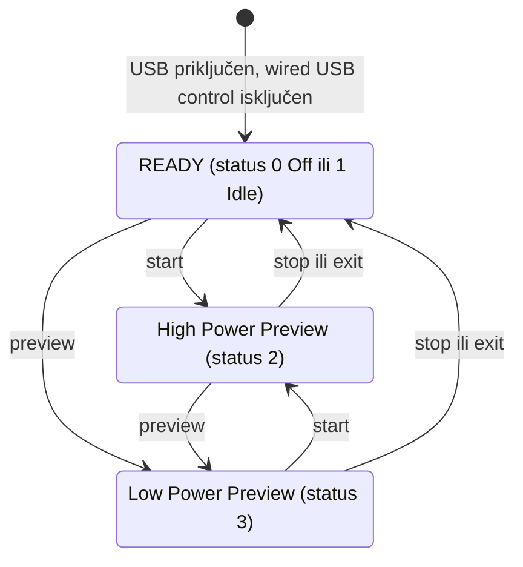

# Open GoPro webcam API za HERO13 Black

- **Status:** Završeno 2026-09-29. Na osnovu ovoga je doneta odluka u ADR 0002 (Open GoPro HTTP API za upravljanje kamerom). Na HERO13 Black sa firmverom 02.10 potvrđeno 2026-10-05: endpoint-i na portu 8080, adresa iz serijskog broja, quirk sa Idle posle priključenja i NCM (`first-slice-gw-start.md` §7.1).
- **Date:** 2026-09-29
- **Owner:** Darko
- **Related:** ADR 0002 (Open GoPro HTTP API za upravljanje kamerom); `upstream-issues-review.md`; `first-slice-gw-start.md`

## 1. Izvori

Pročitano 2026-09-29:

- **[SPEC]** Open GoPro HTTP API 2.0 (OpenAPI 3.1.0), build sa `gh-pages` grane repoa `gopro/OpenGoPro`, commit `616bfb8085` od 2026-06-08. Stranica: https://gopro.github.io/OpenGoPro/http, izvor: `https://raw.githubusercontent.com/gopro/OpenGoPro/gh-pages/http/openapi.json`.
- **[SPEC-2023]** i **[SPEC-2022]**: arhivirane markdown verzije iste specifikacije na web.archive.org (2023-12-02 i 2022-11-26). Neke stvari kažu jasnije od trenutne.
- **[FAQ]**: https://gopro.github.io/OpenGoPro/docs/faq
- **[SDK]**: GoPro-ov Python SDK i demo programi u istom repou. Čitano samo zbog ponašanja, kod se ne prenosi.
- **[ISSUE]**: issue-i u `gopro/OpenGoPro`.

## 2. Endpoint-i

Svi su `GET` na `http://172.2X.1YZ.51:8080`. Preko USB-a nema autentifikacije ni obaveznih zaglavlja [SPEC].

| Endpoint | Parametri | Odgovor | Modeli |
|---|---|---|---|
| `/gopro/webcam/start` | `res`, `fov`, `port` (podrazumevano 8554), `protocol` (`TS` ili `RTSP`) | 200 `{}` | HERO13 Black |
| `/gopro/webcam/stop` | | 200 `{}` | HERO13 Black |
| `/gopro/webcam/exit` | | 200 `{}` | HERO13 Black |
| `/gopro/webcam/preview` | | 200 `{}` | HERO13 Black |
| `/gopro/webcam/status` | | `{"status":N,"error":N}` | HERO13 Black |
| `/gopro/webcam/version` | | `{"version":N,"max_lens_support":bool,"usb_3_1_compatible":bool}` | HERO13 Black |
| `/gopro/camera/control/wired_usb` | `p` = 0 ili 1 | 200 `{}` | HERO10 do HERO13 |
| `/gopro/camera/keep_alive` | | 200 `{}` | HERO9 do HERO13 |

- Build iz juna 2026 za webcam navodi samo HERO13 Black; build iz aprila 2026 navodio je i HERO9 do HERO12, MAX 2 i LIT HERO.
- Redosled parametara je bitan: "HTTP command arguments must be given in the order outlined" [SPEC-2023], primer `?res=12&fov=0&port=8556&protocol=RTSP`. Go-ov `url.Values.Encode()` sortira ključeve, pa `gw` sklapa upit ručno.
- Specifikacija za start, stop, exit i preview navodi prazan objekat, ali kamere vraćaju i `{"status":N,"error":N}`: SDK tako parsira svaki webcam odgovor, a HERO13 u [ISSUE #818] vraća `{"status":4,"error":7}`. Zato `gw` telo tretira kao opcioni JSON i proverava `error` kad postoji.
- Stari `/gp/gpWebcam/...` ne postoji ni u jednoj verziji specifikacije, FAQ-u ni issue-ima u `gopro/OpenGoPro`. Po upstream issue-ima radi na HERO12 i HERO13 (`upstream-issues-review.md` §1.1), ali je nedokumentovan.

## 3. Kodovi

**Rezolucija (`res`)** [SPEC]: 4 = 480p (samo HERO9 i HERO10), 7 = 720p, 12 = 1080p. HERO13 nije u ovoj tabeli ni u jednoj verziji, ali FAQ za "USB: Webcam" navodi 720p i 1080p, a SDK koristi iste kodove. Bez parametra važi 1080p [SPEC-2023].

**FOV (`fov`)** [SPEC, setting 43 "Webcam Digital Lenses", HERO13 naveden izričito]: 0 wide, 2 narrow, 3 superview, 4 linear. Bez parametra važi poslednji korišćen, a ako ga nema, wide [SPEC-2023].

**`port`**: podrazumevano 8554; ne radi na HERO9, HERO10 i HERO11 Mini. Sopstveni port važi samo za TS; RTSP je uvek na 554 [SPEC-2023].

**`protocol`**: `TS` (podrazumevano) ili `RTSP`; ne radi na HERO9 do HERO11. Sa RTSP-om kamera je server na `rtsp://<kamera>:554/live` [SPEC, ISSUE #745].

**`status`** [SPEC]: 0 Off, 1 Idle, 2 High Power Preview, 3 Low Power Preview, 4 Status is unavailable. Kod 4 postoji u tabeli, ali ne u enum-u šeme; HERO13 ga vraća [ISSUE #810, #818].

**`error`** [SPEC]: 0 None, 1 Set Preset, 2 Set Window Size, 3 Exec Stream, 4 Shutter, 5 Com timeout, 6 Invalid param, 7 Unavailable, 8 Exit.

## 4. State machine

Po dijagramu iz specifikacije (https://gopro.github.io/OpenGoPro/assets/images/webcam.png):

- Start važi iz READY i iz oba preview stanja; ponovljen start u High Power Preview ostaje tu.
- Stop zaustavi stream, a kamera ostaje u webcam režimu. Exit zaustavi stream i izađe iz webcam režima [SPEC-2023].
- Hypersmooth (setting 135) se menja samo u READY sa statusom Off, a do toga se stiže preko Exit ili ponovnim priključenjem kabla [SPEC].
- Poznata greška na svim kamerama: posle novog USB priključenja status se prijavi kao Idle umesto Off [FAQ]. GoPro kao zaobilaznicu predlaže start pa odmah stop.
- SDK pre starta pročita status i pošalje stop ako kamera nije u Off ili Idle, pa start i čitanje statusa svake sekunde. Za kraj pošalje stop, sačeka Off ili Idle, pa exit.

## 5. Preduslovi i održavanje veze

- **Wired USB control mora biti isključen** pre webcam komandi preko USB-a: `wired_usb?p=0`. Trenutna specifikacija kaže "should", a [SPEC-2022] "must". Opšte USB uputstvo za druge funkcije traži `p=1`, pa to ne treba mešati. GoPro-ov demo za više kamera šalje `p=0` na početku.
- Status 115 je "USB Connected", a status 116 "USB Controlled"; oba se čitaju preko `/gopro/camera/state`.
- **Keep-alive:** "It is necessary to periodically send a keep-alive"; preporuka je `GET /gopro/camera/keep_alive` na svake 3 s [SPEC]. Starije verzije su tražile bar jednom u 120 s. Kamera zaspi kad isteknu i Auto Power Down (setting 59) i keep-alive tajmer.
- Pre komandi treba sačekati da se ugase System Busy (status 8) i Encoding (status 10) [SPEC]. U prvom preseku se to ne proverava.
- MTP na hostu: na HERO10 i HERO11 automatsko montiranje ili demontiranje preko MTP-a na Ubuntu-u ostavljalo je USB kontrolu u pola, i HTTP je vraćao 500. Pomagalo je `wired_usb` p=0 pa p=1 ili ponovno priključenje [ISSUE #184]. Na Linuxu to može da izazove gvfs.

## 6. Mreža i stream

- Adresa kamere je `172.2X.1YZ.51`, gde je XYZ poslednje tri cifre serijskog broja; primer: serijski `C0000123456789` daje `172.27.189.51` [SPEC]. Serijski broj je na nalepnici ispod poklopca baterije i u Preferences → About → Camera Info.
- mDNS `_gopro-web` postoji, ali HERO13 v01.10.00 ga ne oglašava [FAQ].
- USB traži NCM [SPEC], pa je na hostu verovatno drajver `cdc_ncm`. Šta host dobija specifikacija ne kaže; GoPro-ov C++ demo traži lokalnu adresu `172.20–29.x.50–70` i menja poslednji oktet u `.51`.
- HTTP je na portu **8080**. Port 80, koji koristi stari alat, specifikacija ne pominje.
- Start "starts high-res stream to the IP address of caller" [SPEC-2023]: unicast MPEG-TS preko UDP-a na adresu sa koje je stigao HTTP zahtev. Zato HTTP klijent i ffmpeg moraju da koriste istu adresu hosta na GoPro linku.
- Kodek je AVC/H.264 [SPEC]. FAQ za USB webcam: 720p ili 1080p, 30 fps, oko 6 Mbps, bez zvuka i stabilizacije, najmanje kašnjenje 210 ms, neograničeno trajanje na spoljnom napajanju. FAQ preporučuje `-fflags nobuffer`.

## 7. Poznati problemi za HERO12 i HERO13

- HERO13 v01.10.00: webcam start, exit i preview uvek vraćaju HTTP 500 [FAQ]. GoPro saradnik u [ISSUE #603]: "known issue for Hero 13 initial firmware but it should be fixed now". Minimalni firmver za HERO13 u specifikaciji je v01.10.00; Darkov 02.10 je noviji.
- [ISSUE #818], HERO13 preko USB-a, wired control isključen: status 4, error 7. Nema odgovora GoPro-a.
- [ISSUE #504], HERO12: nasumičan HTTP 500 i zaključan HTTP server do ponovnog priključenja; prijavljeno kao rešeno u novijem firmveru.
- [ISSUE #899], HERO12: Hypersmooth se vrati na 0 posle webcam starta.
