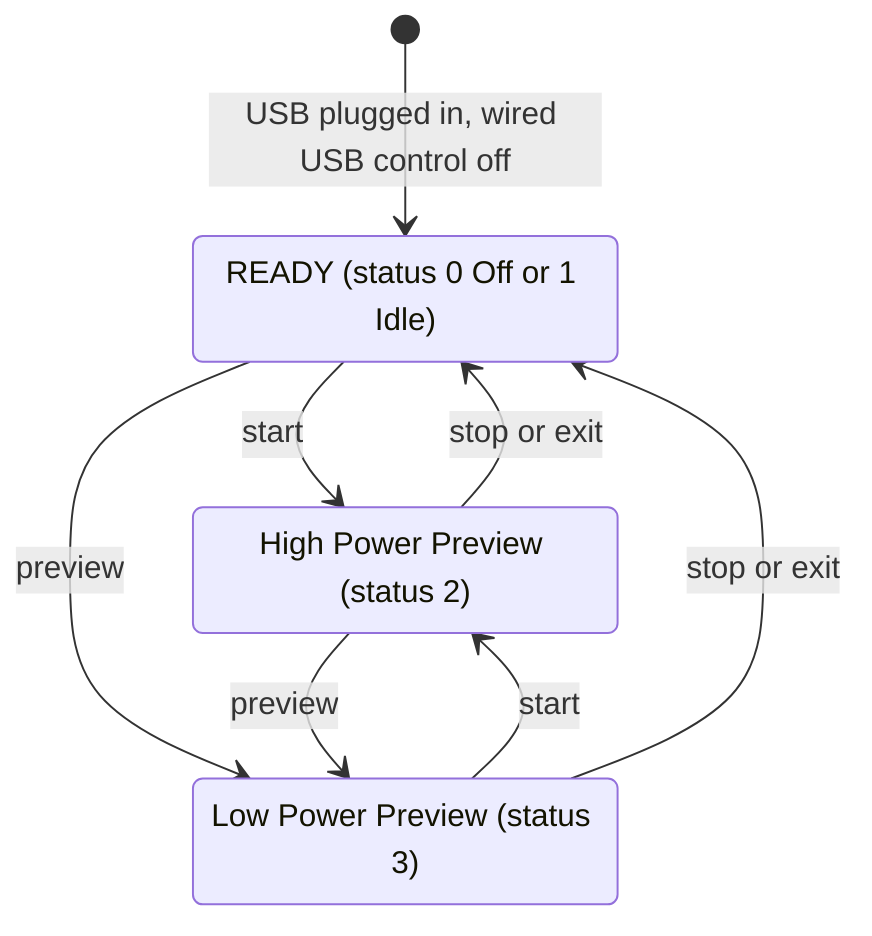

# Open GoPro webcam API for HERO13 Black

- **Status:** Done 2026-09-29. The decision in ADR 0002 (Open GoPro HTTP API for camera control) was made on the basis of this. Confirmed on HERO13 Black with firmware 02.10 on 2026-10-05: the endpoints on port 8080, the address from the serial number, the Idle quirk after plugging in, and NCM (`first-slice-gw-start.md` §7.1).
- **Date:** 2026-09-29
- **Owner:** Darko
- **Related:** ADR 0002 (Open GoPro HTTP API for camera control); `upstream-issues-review.md`; `first-slice-gw-start.md`

## 1. Sources

Read 2026-09-29:

- **[SPEC]** Open GoPro HTTP API 2.0 (OpenAPI 3.1.0), build from the `gh-pages` branch of the `gopro/OpenGoPro` repo, commit `616bfb8085` of 2026-06-08. Page: https://gopro.github.io/OpenGoPro/http, source: `https://raw.githubusercontent.com/gopro/OpenGoPro/gh-pages/http/openapi.json`.
- **[SPEC-2023]** and **[SPEC-2022]**: archived markdown versions of the same specification on web.archive.org (2023-12-02 and 2022-11-26). They state some things more clearly than the current one.
- **[FAQ]**: https://gopro.github.io/OpenGoPro/docs/faq
- **[SDK]**: GoPro's Python SDK and demo programs in the same repo. Read only for behavior; no code is carried over.
- **[ISSUE]**: issues in `gopro/OpenGoPro`.

## 2. Endpoints

All are `GET` on `http://172.2X.1YZ.51:8080`. Over USB there is no authentication and there are no required headers [SPEC].

| Endpoint | Parameters | Response | Models |
|---|---|---|---|
| `/gopro/webcam/start` | `res`, `fov`, `port` (default 8554), `protocol` (`TS` or `RTSP`) | 200 `{}` | HERO13 Black |
| `/gopro/webcam/stop` | | 200 `{}` | HERO13 Black |
| `/gopro/webcam/exit` | | 200 `{}` | HERO13 Black |
| `/gopro/webcam/preview` | | 200 `{}` | HERO13 Black |
| `/gopro/webcam/status` | | `{"status":N,"error":N}` | HERO13 Black |
| `/gopro/webcam/version` | | `{"version":N,"max_lens_support":bool,"usb_3_1_compatible":bool}` | HERO13 Black |
| `/gopro/camera/control/wired_usb` | `p` = 0 or 1 | 200 `{}` | HERO10 to HERO13 |
| `/gopro/camera/keep_alive` | | 200 `{}` | HERO9 to HERO13 |

- The June 2026 build lists only HERO13 Black for webcam; the April 2026 build also listed HERO9 to HERO12, MAX 2 and LIT HERO.
- Parameter order matters: "HTTP command arguments must be given in the order outlined" [SPEC-2023], example `?res=12&fov=0&port=8556&protocol=RTSP`. Go's `url.Values.Encode()` sorts the keys, so `gw` builds the query by hand.
- For start, stop, exit and preview the specification gives an empty object, but cameras also return `{"status":N,"error":N}`: the SDK parses every webcam response that way, and the HERO13 in [ISSUE #818] returns `{"status":4,"error":7}`. So `gw` treats the body as optional JSON and checks `error` when it is present.
- The old `/gp/gpWebcam/...` does not exist in any version of the specification, in the FAQ, or in the issues in `gopro/OpenGoPro`. According to upstream issues it works on HERO12 and HERO13 (`upstream-issues-review.md` §1.1), but it is undocumented.

## 3. Codes

**Resolution (`res`)** [SPEC]: 4 = 480p (HERO9 and HERO10 only), 7 = 720p, 12 = 1080p. HERO13 is not in this table in any version, but the FAQ for "USB: Webcam" lists 720p and 1080p, and the SDK uses the same codes. Without the parameter, 1080p applies [SPEC-2023].

**FOV (`fov`)** [SPEC, setting 43 "Webcam Digital Lenses", HERO13 listed explicitly]: 0 wide, 2 narrow, 3 superview, 4 linear. Without the parameter, the last one used applies, and if there is none, wide [SPEC-2023].

**`port`**: default 8554; does not work on HERO9, HERO10 and HERO11 Mini. A custom port applies only to TS; RTSP is always on 554 [SPEC-2023].

**`protocol`**: `TS` (default) or `RTSP`; does not work on HERO9 to HERO11. With RTSP the camera is the server at `rtsp://<camera>:554/live` [SPEC, ISSUE #745].

**`status`** [SPEC]: 0 Off, 1 Idle, 2 High Power Preview, 3 Low Power Preview, 4 Status is unavailable. Code 4 is in the table but not in the schema's enum; HERO13 returns it [ISSUE #810, #818].

**`error`** [SPEC]: 0 None, 1 Set Preset, 2 Set Window Size, 3 Exec Stream, 4 Shutter, 5 Com timeout, 6 Invalid param, 7 Unavailable, 8 Exit.

## 4. State machine

Following the diagram in the specification (https://gopro.github.io/OpenGoPro/assets/images/webcam.png):

- Start is valid from READY and from both preview states; a repeated start in High Power Preview stays there.
- Stop stops the stream, and the camera stays in webcam mode. Exit stops the stream and leaves webcam mode [SPEC-2023].
- Hypersmooth (setting 135) can be changed only in READY with status Off, which is reached through Exit or by plugging the cable in again [SPEC].
- Known bug on all cameras: after a new USB connection the status is reported as Idle instead of Off [FAQ]. As a workaround GoPro suggests start and then stop right away.
- Before start the SDK reads the status and sends stop if the camera is not in Off or Idle, then start, and reads the status every second. To finish, it sends stop, waits for Off or Idle, then exit.

## 5. Prerequisites and keeping the connection alive

- **Wired USB control must be off** before webcam commands over USB: `wired_usb?p=0`. The current specification says "should", and [SPEC-2022] says "must". The general USB guide for other features asks for `p=1`, so the two must not be mixed up. GoPro's multi-camera demo sends `p=0` at the start.
- Status 115 is "USB Connected", and status 116 is "USB Controlled"; both are read through `/gopro/camera/state`.
- **Keep-alive:** "It is necessary to periodically send a keep-alive"; the recommendation is `GET /gopro/camera/keep_alive` every 3 s [SPEC]. Older versions asked for at least once every 120 s. The camera goes to sleep when both Auto Power Down (setting 59) and the keep-alive timer expire.
- Before commands, wait until System Busy (status 8) and Encoding (status 10) clear [SPEC]. The first slice does not check this.
- MTP on the host: on HERO10 and HERO11, automatic mounting or unmounting over MTP on Ubuntu left USB control half set up, and HTTP returned 500. What helped was `wired_usb` p=0 then p=1, or plugging in again [ISSUE #184]. On Linux gvfs can cause this.

## 6. Network and stream

- The camera's address is `172.2X.1YZ.51`, where XYZ are the last three digits of the serial number; example: serial `C0000123456789` gives `172.27.189.51` [SPEC]. The serial number is on the sticker under the battery door and in Preferences → About → Camera Info.
- mDNS `_gopro-web` exists, but HERO13 v01.10.00 does not advertise it [FAQ].
- USB requires NCM [SPEC], so the driver on the host is probably `cdc_ncm`. The specification does not say what the host gets; GoPro's C++ demo looks for a local address `172.20–29.x.50–70` and changes the last octet to `.51`.
- HTTP is on port **8080**. The specification does not mention port 80, which the old tool uses.
- Start "starts high-res stream to the IP address of caller" [SPEC-2023]: unicast MPEG-TS over UDP to the address the HTTP request came from. So the HTTP client and ffmpeg must use the same host address on the GoPro link.
- The codec is AVC/H.264 [SPEC]. FAQ for USB webcam: 720p or 1080p, 30 fps, about 6 Mbps, no audio and no stabilization, minimum latency 210 ms, unlimited duration on external power. The FAQ recommends `-fflags nobuffer`.

## 7. Known problems for HERO12 and HERO13

- HERO13 v01.10.00: webcam start, exit and preview always return HTTP 500 [FAQ]. A GoPro collaborator in [ISSUE #603]: "known issue for Hero 13 initial firmware but it should be fixed now". The minimum firmware for HERO13 in the specification is v01.10.00; Darko's 02.10 is newer.
- [ISSUE #818], HERO13 over USB, wired control off: status 4, error 7. No answer from GoPro.
- [ISSUE #504], HERO12: random HTTP 500 and an HTTP server locked up until the cable is plugged in again; reported as fixed in newer firmware.
- [ISSUE #899], HERO12: Hypersmooth goes back to 0 after a webcam start.
