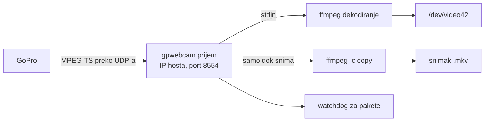

# Tray ikonica i snimanje (0.2.0)

- **Status:** Prihvaćen 2026-10-06: tray preko `fyne.io/systray`, od 2026-10-06 iz forka `darkodemic/systray` (§3.2), u istom procesu kao `gpwebcam run` (§3), preseci redom tray, sopstveni UDP prijem, snimanje (§7). Cilj je izdanje 0.2.0.
- **Date:** 2026-10-06
- **Owner:** Darko
- **Related:** `release-0.1.0.md` §2 (F3), §4; predajna beleška §10.1 (notifikacije), §10.2 (snimanje); `first-slice-gw-start.md` §8 (watchdog za pakete); ADR 0001 (Go kao jezik implementacije); ADR 0003 (gpwebcam drži uređaj kao user servis)

## 1. Obim

Darkov predlog od 2026-10-06: dok servis radi, u system tray-u stoji ikonica. Iz nje se podešava webcam režim i pokreće snimanje. Ko ne želi ikonicu, može da je ugasi.

U obimu:

- tray ikonica sa menijem i stanjem kamere;
- podešavanja iz menija koja se pamte između pokretanja;
- snimanje H.264 streama kamere u fajl, bez ponovnog kodiranja (F3 iz `release-0.1.0.md`).

Van obima za 0.2.0: prozor sa podešavanjima, snimanje na microSD karticu kamere, zvuk (webcam režim ga nema), više kamera.

## 2. Provereno

| Činjenica | Izvor |
|---|---|
| Quickshell na Darkovoj mašini je tray host i watcher (`org.kde.StatusNotifierWatcher`); registrovano je više ikonica drugih aplikacija | `busctl --user`, 2026-10-06 |
| GNOME bez AppIndicator ekstenzije ne prikazuje StatusNotifierItem ikonice; Ubuntu je ima uključenu, Fedora nema | opšte poznato, nije provereno u kontejneru |
| User servis ima `DBUS_SESSION_BUS_ADDRESS` (`unix:path=/run/user/1000/bus`) i `XDG_RUNTIME_DIR` | `systemctl --user show-environment`, 2026-10-06 |
| Veličina frejma u `/dev/video42` određuje se jednom, pri pokretanju `gpwebcam run`, iz `-res`; zamenska slika i stream se skaliraju na nju | `cmd/gpwebcam/serve.go:132`, `internal/stream/stream.go:119` |
| ffmpeg sam sluša UDP na IP adresi hosta na GoPro interfejsu; kamera šalje unicast na jedan port | `internal/stream/stream.go:84`; predajna beleška §2 |
| Unit ima `ProtectHome=read-only` i `ProtectSystem=strict`, pa servis sada ne može da piše u home | `packaging/systemd/gpwebcam.service` |
| `xdg-user-dir VIDEOS` na Darkovoj mašini vraća `/home/user`, jer XDG folder za video nije podešen | 2026-10-06 |
| `fyne.io/systray` v1.12.2 traži Go 1.19 i zavisi od `godbus/dbus/v5` i `golang.org/x/sys`; `godbus/dbus/v5` v5.2.2 traži Go 1.20. Oba se slažu sa `go 1.22` u `go.mod` | proxy.golang.org, 2026-10-06 |
| `fyne.io/systray` v1.12.2: cgo samo u `systray_darwin.go`; Linux deo (`systray_unix.go`) je čist Go preko D-Bus-a. Prati `NameOwnerChanged` za `org.kde.StatusNotifierWatcher` i ponovo se registruje kad se watcher pojavi. Ima `RunWithExternalLoop` za program koji već ima svoju petlju. Stanje drži u globalnoj promenljivoj, a greške piše kroz standardni `log` | izvorni kod v1.12.2 sa proxy.golang.org, 2026-10-06 |
| `fyne.io/systray` nema radio stavke ni u v1.12.2 ni na `master`-u (`528cad2`): na Linuxu šalje samo dbusmenu `toggle-type` `checkmark`, iako spec ima i `radio`. Nema ni issue-a ni PR-a za to, ni u `fyne-io/systray` ni u `getlantern/systray` | izvorni kod i `gh search`, 2026-10-06 |
| `fyne-io/systray` je GitHub fork `getlantern/systray`: 186 commit-a ispred, 17 iza. Tih 17 su iz 2021–2023, uglavnom GTK i libayatana-appindicator, koje je fyne namerno izbacio, plus dve Windows ispravke za podmenije. `getlantern/systray` je poslednji put menjan 2024-07-03, `fyne-io/systray` 2026-08 | GitHub compare API, 2026-10-06 |

## 3. Tray

### 3.1 Proces

Odlučeno 2026-10-06: tray radi u istom procesu kao `gpwebcam run`. Tako nema drugog servisa ni komunikacije između procesa, a meni direktno menja stanje sesije. D-Bus treba samo session bus, a ne ekran, pa radi i iz user servisa.

Alternativa je poseban proces `gpwebcam tray` sa sopstvenim user servisom, koji servisu šalje komande preko Unix socket-a. Prednosti su da pad tray-a ne ruši webcam i da glavni servis ostaje bez spoljnih zavisnosti. Mane su dva servisa koja korisnik uključuje i protokol između njih.

### 3.2 Biblioteka

Odlučeno 2026-10-06 (Darko): `fyne.io/systray`.

Dopunjeno 2026-10-06 (Darko): gpwebcam koristi fork [darkodemic/systray](https://github.com/darkodemic/systray) preko `replace` u `go.mod`. Razvoj biblioteke se nastavlja u forku; izmene korisne i drugima idu i kao PR u `fyne-io/systray`. Razlog je pun nadzor nad bibliotekom, pa radio stavke (§9) ne čekaju upstream izdanje.

- Grana u forku nosi ime po izmeni, ne po gpwebcam-u (Darko, 2026-10-06): radio stavke su na `radio-menu-items`, a sledeće izmene na granama kao `feat/<izmena>`.
- `master` forka je naša linija (Darko, 2026-10-06): izmene se spajaju u njega, a `replace` pokazuje na commit sa njega. Grana za PR u `fyne-io/systray` pravi se od njihovog `master`-a, da ne nosi naše ostale izmene. `radio-menu-items` je fast-forward-ovana u `master` forka (`9c45f67`). U lokalnom klonu `~/Projects/systray` je `origin` fork, a `upstream` `fyne-io/systray`.
- `replace` umesto preimenovanja modula u `github.com/darkodemic/systray`: importi ostaju `fyne.io/systray`, a povratak na upstream je brisanje jednog reda.
- Posledice: `go install …@latest` ne radi kad `go.mod` ima `replace` (README ga ne nudi); Debian arhiva (`packaging-and-release.md` §4, korak 4) ne prihvata zavisnost iz forka, pa pre ITP-a treba ili upstream izdanje ili preimenovan modul sa tagovima; Dependabot za `fyne.io/systray` samo javlja upstream izdanja, a fork se ažurira ručno.

Go standardna biblioteka nema D-Bus, pa je ovo prva spoljna zavisnost (ADR 0001 kaže "standardna biblioteka prvo", ne "samo").

| Opcija | Za | Protiv |
|---|---|---|
| `fyne.io/systray` | gotov StatusNotifierItem i dbusmenu; na Linuxu bez GTK-a i cgo-a, pa binarni fajl ostaje statički; sam se ponovo registruje (§2) | dve zavisnosti (`systray`, `godbus`); globalno stanje i standardni `log` umesto `slog`-a |
| sopstveni StatusNotifierItem i dbusmenu na `godbus/dbus/v5` | jedna zavisnost; pun nadzor nad ponovnom registracijom i ikonicama | nekoliko stotina linija koda i testova više |
| sopstveni minimalni D-Bus klijent | nula zavisnosti | previše posla za ovu korist |

### 3.3 Meni

Samo meni, bez prozora: prozor traži GUI biblioteku, a to je mnogo veća zavisnost od D-Bus-a.

- stanje, neaktivna stavka: na primer "HERO13 Black · 1080p · linear · stream radi"
- Snimaj / Zaustavi snimanje, sa trajanjem dok snima
- Otvori folder sa snimcima (`xdg-open`)
- Vidno polje: wide, narrow, superview, linear (radio)
- Rezolucija: 1080p, 720p (radio)
- Hardversko dekodiranje (čekboks)
- Notifikacije (čekboks)
- Sakrij ikonicu

Ikonica pokazuje stanje. Po Darkovoj želji od 2026-10-06 (`camera-on-demand.md` §4): bela dok video teče, narandžasta kad ima problem, izbledela bela inače; dok snima, dobija crvenu tačku.

### 3.4 Gašenje ikonice

- `-tray=false` u unit-u (`systemctl --user edit gpwebcam.service`) gasi tray.
- "Sakrij ikonicu" u meniju upiše to u podešavanja (§4). Ikonica se vraća kroz podešavanja ili flag, i README to opisuje.
- Kad tray host ne postoji (GNOME bez ekstenzije, prijava preko SSH-a), servis radi kao do sada, bez greške.

### 3.5 Tray host koji dolazi kasnije

Pri prijavi servis može da krene pre Quickshell-a ili panela, a panel može i da se restartuje. Ikonica zato prati kad se `org.kde.StatusNotifierWatcher` pojavi na bus-u i tada se ponovo registruje. `fyne.io/systray` to radi sam (§2); sopstvena implementacija bi morala isto.

## 4. Podešavanja

- Izbori iz menija čuvaju se u `~/.config/gpwebcam/` (`$XDG_CONFIG_HOME`). Format je još otvoren; JSON iz standardne biblioteke je najjednostavniji.
- Flag u unit-u ima prednost nad fajlom. Ta stavka je tada zaključana u meniju, uz napomenu da je zadata u servisu.
- Vidno polje se menja uživo: sesija pošalje stop pa START sa novim FOV-om. Kamera se vraća za oko 4 s, a za to vreme se vidi zamenska slika. Aplikacija koja koristi kameru ne primeti ništa osim prekida slike.
- Rezolucija se ne menja uživo. Format uređaja aplikacija preuzme kad otvori kameru, pa bi promena usred rada prekinula sliku u Zoom-u. Nova rezolucija važi pri sledećem pokretanju servisa ili kad uređaj ne koristi nijedna aplikacija. Kako se pouzdano zna da ga niko ne koristi, treba istražiti; dotle važi posle restarta servisa, uz poruku u meniju.

## 5. Snimanje

### 5.1 Prijem streama

Kamera šalje stream na jedan UDP port, pa snimanje mora da koristi isti prijem kao webcam.

| Opcija | Za | Protiv |
|---|---|---|
| A: ffmpeg se restartuje sa drugim izlazom (kopija u fajl) | mala izmena | webcam slika nestaje 1 do 2 s pri svakom pokretanju i zaustavljanju snimanja |
| B: `gpwebcam` sam prima UDP i šalje pakete ffmpeg-u za webcam i, dok snima, snimaču | snimanje bez prekida slike; watchdog za pakete iz `first-slice-gw-start.md` §8 dobija se usput | menja put koji je podešen na 0.18 s kašnjenja; mora ponovo da se izmeri |

Odlučeno: B, urađeno 2026-10-06 (presek 2, §9). Pravilo da se sluša samo na IP adresi hosta na GoPro interfejsu ostaje (`net.ListenUDP` na toj adresi), a datagrami se primaju još samo sa adrese kamere.

### 5.2 Fajl

- `-map 0:v:0 -c copy`: samo video, bez ponovnog kodiranja; procesor skoro ne radi.
- Matroska (`.mkv`), jer ostaje čitljiva i kad snimanje prekine izvučen kabl (predajna beleška §10.2).
- Folder: odlučeno 2026-10-07 (Darko), uvek `~/Videos/gpwebcam`, jer unit dozvoljava pisanje samo u `~/Videos` (§6). Drugi folder: flag `-record-dir` uz drop-in sa `ReadWritePaths`. Prvobitni predlog sa `$XDG_VIDEOS_DIR` je odbačen: na Darkovoj mašini XDG folder za video nije podešen, a lokalizovan folder bi unit ionako morao posebno da dozvoli. Ime fajla po vremenu početka, na primer `GoPro-2026-10-06-135012.mkv`; isto vreme dobija `-2`, `-3`.
- Oko 6 Mb/s, oko 2.7 GB na sat. Bez zvuka.
- Izvlačenje kabla ili zaustavljanje servisa završava snimak, i fajl ostaje ispravan. Kad se kamera vrati, snimanje se ne nastavlja samo; korisnik ga ponovo pokreće.

### 5.3 Bez tray-a

Ko nema tray, snima komandom `gpwebcam record start|stop`. Komanda razgovara sa servisom preko Unix socket-a u `$XDG_RUNTIME_DIR/gpwebcam/` (HTTP preko `net/http`, standardna biblioteka). Odlučeno 2026-10-06 (Darko): ide u 0.2.0.

## 6. Unit i sandbox

- Servis treba da piše u folder sa snimcima i u `~/.config/gpwebcam/`. `ConfigurationDirectory=gpwebcam` daje pravo pisanja u `~/.config/gpwebcam` uprkos `ProtectHome=read-only` (provereno 2026-10-06, §9).
- Za snimke, odlučeno 2026-10-07 (Darko): `ReadWritePaths=-%h/Videos`, a `ProtectHome=read-only` ostaje. "-" znači da unit ne pada kad folder ne postoji (provereno 2026-10-07 privremenim user unit-om); snimanje tada ne uspe, sa porukom. Druga opcija, postavka sa bilo kojim folderom bez `ProtectHome`, je odbačena jer bi servis i ffmpeg smeli da pišu svuda u home.
- Kontrolni socket: `RuntimeDirectory=gpwebcam` daje `/run/user/<uid>/gpwebcam`, u koji servis sme da piše, dok je ostatak `/run/user/<uid>` pod `ProtectSystem=strict` samo za čitanje (provereno 2026-10-07).
- Folder sa snimcima otvara fajl menadžer preko `org.freedesktop.FileManager1.ShowFolders` na session D-Bus-u. Proces pokrenut iz servisa (`xdg-open`) bi delio njegov sandbox, pa i home samo za čitanje; D-Bus aktivacija pokreće fajl menadžer van njega.
- `RestrictAddressFamilies` već dozvoljava `AF_UNIX`, pa D-Bus i kontrolni socket rade bez izmene.

## 7. Preseci

Redosled odlučen 2026-10-06 (Darko):

1. Podešavanja u fajlu i tray meni sa vidnim poljem, rezolucijom, hardverskim dekodiranjem, notifikacijama i sakrivanjem. Ne dira put streama.
2. Sopstveni UDP prijem (§5.1, opcija B), merenje kašnjenja i watchdog za pakete.
3. Snimanje: stavka u meniju i, po odluci, `gpwebcam record`.

Uz svaki presek: README, man stranica, `doctor` (tray host, folder za snimke) i CONTRIBUTING kad se menja raspored paketa.

## 8. Test plan

- Tray na Quickshell-u: ikonica se pojavi; posle restarta Quickshell-a se vrati; meni menja FOV uživo, a Zoom ostaje povezan.
- Bez tray host-a (kontejner, SSH): servis radi i ne piše greške u petlji.
- Kašnjenje sa sopstvenim prijemom naspram 0.18 s pre izmene, ista metoda kao u `second-slice-gw-run.md` §4.
- Snimanje: početak i kraj iz menija; izvučen kabl usred snimanja ostavlja fajl koji se pušta; snimanje ne prekida sliku u Zoom-u.
- Paketi: unit sa novim `ReadWritePaths` na sve četiri distribucije u kontejnerima.

## 9. Gde smo i šta sledi

- 2026-10-06: Darkov predlog, provere iz §2 i ovaj plan. Darko prihvatio tray u istom procesu, `fyne.io/systray` i redosled preseka.
- 2026-10-06, presek 1 napisan (testovi prolaze sa `-race`, i na Go 1.22):
  - `internal/settings`: JSON u `~/.config/gpwebcam/settings.json` (`$CONFIGURATION_DIRECTORY`, pa `$XDG_CONFIG_HOME`); fajl može da ima samo izmenjene ključeve; nepoznat ključ ili vrednost je greška, a servis tada zadržava podrazumevane ili poslednje ispravne vrednosti.
  - `gpwebcam config [<setting> [<value>]]`; servis proverava fajl na 2 s i primenjuje izmenu. Flag zadat na komandnoj liniji ima prednost i zaključava stavku u meniju.
  - Izmena FOV-a ili dekodera prekida sesiju (`errReconfigured`), a petlja odmah pokreće novu. Sesija se registruje za prekid pre nego što pročita podešavanja. Rezolucija se pamti i važi posle restarta.
  - `internal/tray`: meni iz §3.3 bez stavki za snimanje; ikonica nacrtana u kodu (64x64, siva, plava, narandžasta).
  - `doctor`: provera fajla sa podešavanjima i tray host-a (`NameHasOwner` za `org.kde.StatusNotifierWatcher` preko `godbus`).
  - Unit: `ConfigurationDirectory=gpwebcam`. Provereno privremenim user unit-om (`systemd-run --user`): sa njim se u `~/.config/gpwebcam` piše uprkos `ProtectHome=read-only`, bez njega "Read-only file system", a systemd postavlja `CONFIGURATION_DIRECTORY`.
  - Privremeni demo program na Quickshell-u: ikonica se registruje i nestaje, ponovo se pokreće u istom procesu (sakrij pa `config tray on` radi bez restarta), tooltip i meni se menjaju, a klikovi poslati kroz `com.canonical.dbusmenu.Event` stižu do podešavanja.
  - v4l2loopback 0.15.4 (`vidioc_try_fmt_vid`): dok čitač drži format, pisac pri `S_FMT` dobije stari format bez greške. Zato rezolucija uživo nije bezbedna; `OpenOutput` povratni format i ne proverava.
  - Binarni fajl je i dalje statički, 9.2 MB umesto 7.1 MB (D-Bus i tray). Dependabot sada prati i Go module.
- 2026-10-06: commit `dbde29f`, CI zelen. Darko instalirao snapshot paket; `gpwebcam config res 720` pa restart servisa: uređaj `YU12:1280x720@30`, ikonica registrovana kod Quickshell-a, `doctor` bez problema. Sa kamerom: prvo HTTP 500 sa error 4 (Shutter) na svaki START, jer kamera nije imala bateriju (predajna beleška §2); sa baterijom 720p, linear i VAAPI rade, video 4.5 s posle priključenja.
- Nađeno usput, ispravke čekaju Darkovu odluku: (1) `v4l2.OpenOutput` ne proverava format koji je drajver prihvatio, pa bi start u drugoj rezoluciji dok aplikacija drži uređaj dao pokvarenu sliku; predlog je da servis nastavi u veličini koju uređaj ima, a nova rezolucija čeka sledeći restart. (2) Error 4 se prikazuje kao opšti "Camera problem"; predlog je posebna poruka na zamenskoj slici i u notifikaciji (baterija, pa gašenje kamere).
- 2026-10-06, proba iz menija sa kamerom (720p), Darko: "sve radi". Iz loga, od klika do "video is flowing":

  | Izmena | Vreme |
  |---|---|
  | FOV wide | 5.8 s |
  | FOV superview | oko 20 s: START 2.3 s posle STOP-a vratio error 4; sledeći START prijavio stream bez videa, pa stop i START posle 3 s i watchdog posle 6 s; slika u trećoj sesiji |
  | FOV narrow | 5.5 s |
  | FOV linear | 5.5 s |
  | hwdec none | 5.4 s |
  | hwdec auto | 5.7 s |

  Hide icon u 21:29:58, `gpwebcam config tray on` u 21:30:05: ikonica ponovo registrovana bez restarta servisa. Pri svakom startu sa VAAPI-jem ffmpeg upiše tri linije "hardware accelerator failed to decode picture" pre prvog frejma; ima ih i u logu buildova od 2026-10-05, pa nisu nove.
- Ideja posle superview slučaja: kad START vrati error 4, ponoviti START posle oko 1 s u istoj sesiji, umesto da se sesija završi i čeka `retryDelay`.
- 2026-10-06: Darko odobrio ispravke (1) i (2), a ponovni START posle error 4 "ako možeš sam da ga obradiš". Urađeno (testovi prolaze sa `-race`, i na Go 1.22):
  - `v4l2.OpenOutput` čita format koji je `S_FMT` vratio. Drugi pixel format je greška; druga veličina se prihvata. Servis tada nastavlja u toj veličini, kameru traži u rezoluciji te veličine (`camera.ResolutionFor`), upiše upozorenje u log i pošalje notifikaciju, a tray prikazuje da nova rezolucija čeka restart. Potvrđeno u v4l2loopback 0.15.4 (`vidioc_s_fmt_vid`): pisac dobija OUTPUT token i stari format, bez `EBUSY`.
  - `camera.ErrCannotCapture` za error 4, i kad stigne kao HTTP 500 sa JSON telom (HERO13). `StartWebcam` šalje START do 3 puta, 1 s razmaka, dok kamera vraća error 4; posle toga sesija se završava, zamenska slika kaže "Camera cannot start. Is its battery in and charged?", a notifikacija predlaže proveru baterije i gašenje kamere. Da li ponovljeni START pomaže u slučaju sa baterijom, nije provereno, jer se ne može namerno izazvati; test sa lažnom kamerom pokriva oba ishoda.
  - Test za zamensku sliku sada proverava da svaka poruka staje u sliku. Prvi pokušaj (`leftmost <= 0`) ne bi ništa uhvatio: red od 120 znakova počinje u koloni 3, jer ffmpeg odseca slova na ivici; sada se traži margina od 1/20 širine. Nova poruka počinje na 131 px od 640, "Camera not answering…" na 122.
- 2026-10-06, ispravka (1) uživo: ffmpeg čitač (`-f v4l2 -i /dev/video42`) drži uređaj u 720p; servis zaustavljen, čitač ostaje; build iz radnog stabla sa `-res 1080` upiše "an application keeps the device at its size" (`size=1280x720 wanted=1920x1080`), uređaj ostaje `YU12:1280x720`, kamera krene u 720p i video teče za 4.2 s. Usput: ffmpeg čitač kome je pisac nestao ne reaguje na SIGTERM, tek na SIGKILL; zbog toga je kamera u probi stajala oko 2 min.
- 2026-10-06: commit `301bf30`, CI zelen.
- 2026-10-06: Darko pitao za restart iz menija i kameru koja radi samo kad je aplikacija traži; predlog je `camera-on-demand.md`. Ikonica promenjena: bela, narandžasta i izbledela bela umesto sive, plave i narandžaste.
- 2026-10-06: Darko odlučio da rad na zahtev (`camera-on-demand.md`) ide pre preseka 2.
- 2026-10-06: Darko primetio da kamera, vidno polje i rezolucija u meniju imaju čekbokse iako se bira jedna vrednost, jer biblioteka nema radio stavke (§2). Dogovoreno: dodati ih u `fyne.io/systray` i poslati PR. Urađeno u lokalnom klonu `~/Projects/systray` (od `master`-a `528cad2`), commit `9c45f67` na grani `radio-menu-items` forka `darkodemic/systray`, PR [fyne-io/systray#135](https://github.com/fyne-io/systray/pull/135):
  - `AddMenuItemRadio` i `AddSubMenuItemRadio`, sa istim `Check`/`Uncheck` kao čekboks; ekskluzivnost grupe drži aplikacija, kao do sada u `show`. Linux i BSD: `toggle-type` `radio`; Windows: `MFT_RADIOCHECK`; macOS bez izmene, jer tamo i izbor jedne vrednosti nosi kvačicu.
  - Test za `toggle-type` i `toggle-state`, grupa "Size" u primeru, README. Testovi prolaze, Windows build prolazi; primer pokrenut na Quickshell-u vraća `toggle-type` `radio` kroz `GetLayout`. Windows test fajl se na upstream `master`-u ne kompajlira ni bez ove izmene (`systray_windows_test.go:47`, stara signatura).
  - gpwebcam: tri poziva u `internal/tray/tray.go` prešla na `AddSubMenuItemRadio`.
- 2026-10-06: Darko odlučio da gpwebcam pređe na fork (§3.2). `go.mod`: `replace fyne.io/systray => github.com/darkodemic/systray v1.12.3-0.20261006205618-9c45f672f861`, commit `9c45f67` sa grane `radio-menu-items`. Provereno bez `go.work`: `gofmt`, `go vet` i `go test -race` prolaze na Go 1.27.1 i 1.22.12; `goreleaser release --snapshot --clean` pravi svih šest paketa; binarni fajl je i dalje statički, a `go version -m` pokazuje fork.
- 2026-10-06: rad na zahtev završen (`camera-on-demand.md`, commit-i `ee8ee18` i `99a6349`).
- 2026-10-06, presek 2 napisan u worktree-ju `.worktrees/receive-udp`, grana `feat/receive-udp-in-gpwebcam` (testovi prolaze sa `-race`, i na pravom Go 1.22):
  - `internal/stream/receive.go`: `net.ListenUDP` na adresi hosta, samo datagrami sa adrese kamere (ostali se broje kao tuđi); red od 2048 datagrama (oko 3.5 s) između socket-a i ffmpeg-ovog stdin-a, pa spor ffmpeg ne blokira socket, nego se višak odbacuje i broji, kao ranije `overrun_nonfatal`.
  - ffmpeg čita `-f mpegts -i pipe:0` i više ne otvara socket. Čuvar za pakete je sada u gpwebcam-u: `ReadTimeout` od poslednjeg datagrama, a pre prvog važi `FirstFrame`.
  - Greške: `ErrNoPackets` (nijedan datagram, verovatno firewall ili VPN) i `ErrNoVideo` sa brojem datagrama kad stižu, a ffmpeg ništa ne dekodira. Savet o firewall-u na zamenskoj slici sada ide samo uz `ErrNoPackets`. Brojači (primljeno, odbačeno, tuđe) idu u log kad nešto fali.
  - ffmpeg koji čeka na pipe-u ne reaguje na SIGTERM; prekid sada prvo zatvori njegov stdin, pa ffmpeg izlazi odmah (test prekida: 0.3 s umesto 2.3 s, odnosno umesto `grace`).
  - Kašnjenje, novi test `TestLatency` (`GPWEBCAM_LATENCY=1`): lokalni libx264 640x360 30 fps, broj frejma upisan u piksele, vreme slanja iz `showinfo`; 390 frejmova po merenju. Stari put (ffmpeg sluša UDP, `main` `99a6349`): medijana 134 ms softverski, 135 ms VAAPI; novi: 134 ms i 135 ms; p90 135 i 136 ms u oba. Sopstveni prijem ne dodaje kašnjenje. Stalnih oko 134 ms (4 frejma) je u putu pošiljalac i dekoder, isto za obe verzije; zato test poredi verzije, a ne meri kašnjenje kamere.
- 2026-10-06: proba uživo: video 4.1 s posle uključivanja, bez tuđih i odbačenih datagrama, pa kamera šalje sa svoje adrese. Darko instalirao paket i probao sa Zoom-om. Commit `4f4ff85`, CI zelen.
- 2026-10-07, presek 3 napisan u worktree-ju `.worktrees/recording`, grana `feat/recording` (testovi prolaze sa `-race`, i na pravom Go 1.22):
  - `stream.Config.OnPacket` daje snimaču iste datagrame koje dobija dekoder, bez kopiranja; svaki datagram ima svoj slice koji niko ne menja.
  - `internal/record`: drugi ffmpeg, `-f mpegts -i pipe:0 -map 0:v:0 -c copy -f matroska`, svoj red od 2048 datagrama (višak se odbacuje i broji), proces na zaključanoj niti zbog `Pdeathsig`. Fajl se pravi unapred sa `O_EXCL`, pa ga ffmpeg prepisuje. Potrebno je najmanje 1 GB slobodnog mesta. Test: TS sa video i audio stream-om iseče se na datagrame, a `ffprobe` potvrđuje Matroska fajl sa samo video stream-om od oko 3 s.
  - Servis: snimanje važi dok ga korisnik ne ugasi, a fajl postoji dok traje sesija; nova sesija (promena FOV-a ili dekodera) otvara novi fajl. Snimanje drži kameru upaljenom i u režimu demand. Izvučen kabl i režim off završavaju snimanje, i ono se ne nastavlja samo. Kad ffmpeg sam stane (pun disk), snimanje se gasi uz notifikaciju.
  - Kontrolni API: `GET /v1/status`, `POST /v1/record/start`, `POST /v1/record/stop`, socket 0600; `gpwebcam record [start|stop]` čeka do 20 s da se fajl otvori, jer kamera u režimu demand prvo mora da krene.
  - Tray: Record, Stop recording sa vremenom (osvežava se svake sekunde), Open recordings folder; crvena tačka na ikonici dok se snima.
  - `doctor` proverava `~/Videos` i slobodno mesto.
- 2026-10-07, proba uživo (build iz worktree-ja, snimci u scratchpad, 720p, režim demand): `gpwebcam record start` dok kamera miruje pokrene kameru, a fajl se otvori za 2.4 s; promena FOV-a tokom snimanja sačuva prvi fajl i otvori drugi; `record stop` ispiše fajl, trajanje i veličinu. `ffprobe`: oba fajla su Matroska sa jednim H.264 1280x720 stream-om, 7.0 s i 3.5 s (ffmpeg pri kopiranju odbacuje početne frejmove do prvog ključnog). Pisanje u `~/Videos` iz sandbox-a servisa ostaje za probu sa paketom.
- 2026-10-07, Darkova proba paketa iz radnog stabla: Record i Stop iz menija, snimanje u 1080p posle promene rezolucije i otvaranje foldera rade iz sandbox-a servisa (`~/Videos/gpwebcam`, `ReadWritePaths=-%h/Videos`). Dve ispravke:
  - Veličina u notifikaciji: "8 MB" za fajl koji Nautilus prikazuje kao 9.2 MB. Bajtovi su bili tačni (`bytes=9165466` u logu, isto kao `ls`), ali su prikazani kao MiB (`>>20`), bez decimala. Sada `record.SizeText` računa decimalno sa jednom decimalom, kao Nautilus i Dolphin, i u notifikaciji, i u `gpwebcam record stop`, i u porukama o slobodnom mestu; prag je tačno 1 GB.
  - Prvi snimak je pao na sesiju u kojoj je kamera prijavila stream, a stiglo je samo 49 datagrama bez ijednog frejma, pa je ostao fajl od 52 kB bez slike. Snimač sada kreće sa prvim dekodiranim frejmom, a ne na početku sesije, pa sesija bez videa ne ostavlja fajl.
- 2026-10-07: Darko predložio "Quit gpwebcam" na dnu menija i pokretač u meniju aplikacija, da se servis vrati bez terminala; dogovoreno oboje. Quit zaustavlja servis preko systemd-a (`GetUnitByPID`, pa `Unit.Stop`), pa ga systemd ne pokreće ponovo; bez systemd-a samo uredno završi proces. Notifikacija ide sinhrono (`notify.SendNow`), pre nego što proces nestane. Pokretač: `packaging/desktop/gpwebcam.desktop` u `/usr/share/applications`, "GoPro Webcam", ikonica `camera-web` iz teme dok Darko ne napravi svoju; pokreće `gpwebcam launch`, koji pokreće servis preko `Manager.StartUnit`, čeka da bude aktivan i notifikacijom javlja ishod, jer iz menija nema terminala. `desktop-file-validate` bez primedbi; `gpwebcam launch` dok servis radi kaže "already running".
- Sledeće: proba paketa (Quit, GoPro Webcam iz menija), commit preseka 3, pa izdanje 0.2.0.
