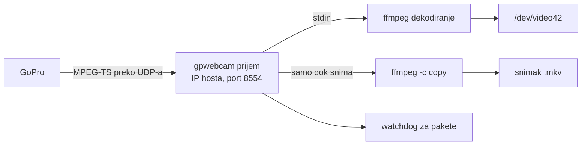

# Tray ikonica i snimanje (0.2.0)

- **Status:** Prihvaćen 2026-10-06: tray preko `fyne.io/systray` u istom procesu kao `gpwebcam run` (§3), preseci redom tray, sopstveni UDP prijem, snimanje (§7). Cilj je izdanje 0.2.0.
- **Date:** 2026-10-06
- **Owner:** Darko
- **Related:** `release-0.1.0.md` §2 (F3), §4; predajna beleška §10.1 (notifikacije), §10.2 (snimanje); `first-slice-gw-start.md` §8 (watchdog za pakete); ADR 0001 (Go kao jezik implementacije); ADR 0003 (gpwebcam drži uređaj kao user servis)

## 1. Obim

Darkov predlog od 2026-10-06: dok servis radi, u system tray-u stoji ikonica. Iz nje se podešava webcam režim i pokreće snimanje. Ko ne želi ikonicu, može da je ugasi.

U obimu:

- tray ikonica sa menijem i stanjem kamere;
- podešavanja iz menija koja se pamte između pokretanja;
- snimanje H.264 streama kamere u fajl, bez ponovnog kodiranja (F3 iz `release-0.1.0.md`).

Van obima za 0.2.0: prozor sa podešavanjima, snimanje na microSD karticu kamere, zvuk (webcam režim ga nema), više kamera.

## 2. Provereno

| Činjenica | Izvor |
|---|---|
| Quickshell na Darkovoj mašini je tray host i watcher (`org.kde.StatusNotifierWatcher`); registrovano je više ikonica drugih aplikacija | `busctl --user`, 2026-10-06 |
| GNOME bez AppIndicator ekstenzije ne prikazuje StatusNotifierItem ikonice; Ubuntu je ima uključenu, Fedora nema | opšte poznato, nije provereno u kontejneru |
| User servis ima `DBUS_SESSION_BUS_ADDRESS` (`unix:path=/run/user/1000/bus`) i `XDG_RUNTIME_DIR` | `systemctl --user show-environment`, 2026-10-06 |
| Veličina frejma u `/dev/video42` određuje se jednom, pri pokretanju `gpwebcam run`, iz `-res`; zamenska slika i stream se skaliraju na nju | `cmd/gpwebcam/serve.go:132`, `internal/stream/stream.go:119` |
| ffmpeg sam sluša UDP na IP adresi hosta na GoPro interfejsu; kamera šalje unicast na jedan port | `internal/stream/stream.go:84`; predajna beleška §2 |
| Unit ima `ProtectHome=read-only` i `ProtectSystem=strict`, pa servis sada ne može da piše u home | `packaging/systemd/gpwebcam.service` |
| `xdg-user-dir VIDEOS` na Darkovoj mašini vraća `/home/user`, jer XDG folder za video nije podešen | 2026-10-06 |
| `fyne.io/systray` v1.12.2 traži Go 1.19 i zavisi od `godbus/dbus/v5` i `golang.org/x/sys`; `godbus/dbus/v5` v5.2.2 traži Go 1.20. Oba se slažu sa `go 1.22` u `go.mod` | proxy.golang.org, 2026-10-06 |
| `fyne.io/systray` v1.12.2: cgo samo u `systray_darwin.go`; Linux deo (`systray_unix.go`) je čist Go preko D-Bus-a. Prati `NameOwnerChanged` za `org.kde.StatusNotifierWatcher` i ponovo se registruje kad se watcher pojavi. Ima `RunWithExternalLoop` za program koji već ima svoju petlju. Stanje drži u globalnoj promenljivoj, a greške piše kroz standardni `log` | izvorni kod v1.12.2 sa proxy.golang.org, 2026-10-06 |

## 3. Tray

### 3.1 Proces

Odlučeno 2026-10-06: tray radi u istom procesu kao `gpwebcam run`. Tako nema drugog servisa ni komunikacije između procesa, a meni direktno menja stanje sesije. D-Bus treba samo session bus, a ne ekran, pa radi i iz user servisa.

Alternativa je poseban proces `gpwebcam tray` sa sopstvenim user servisom, koji servisu šalje komande preko Unix socket-a. Prednosti su da pad tray-a ne ruši webcam i da glavni servis ostaje bez spoljnih zavisnosti. Mane su dva servisa koja korisnik uključuje i protokol između njih.

### 3.2 Biblioteka

Odlučeno 2026-10-06 (Darko): `fyne.io/systray`.

Go standardna biblioteka nema D-Bus, pa je ovo prva spoljna zavisnost (ADR 0001 kaže "standardna biblioteka prvo", ne "samo").

| Opcija | Za | Protiv |
|---|---|---|
| `fyne.io/systray` | gotov StatusNotifierItem i dbusmenu; na Linuxu bez GTK-a i cgo-a, pa binarni fajl ostaje statički; sam se ponovo registruje (§2) | dve zavisnosti (`systray`, `godbus`); globalno stanje i standardni `log` umesto `slog`-a |
| sopstveni StatusNotifierItem i dbusmenu na `godbus/dbus/v5` | jedna zavisnost; pun nadzor nad ponovnom registracijom i ikonicama | nekoliko stotina linija koda i testova više |
| sopstveni minimalni D-Bus klijent | nula zavisnosti | previše posla za ovu korist |

### 3.3 Meni

Samo meni, bez prozora: prozor traži GUI biblioteku, a to je mnogo veća zavisnost od D-Bus-a.

- stanje, neaktivna stavka: na primer "HERO13 Black · 1080p · linear · stream radi"
- Snimaj / Zaustavi snimanje, sa trajanjem dok snima
- Otvori folder sa snimcima (`xdg-open`)
- Vidno polje: wide, narrow, superview, linear
- Rezolucija: 1080p, 720p
- Hardversko dekodiranje (čekboks)
- Notifikacije (čekboks)
- Sakrij ikonicu

Ikonica pokazuje stanje: siva bez kamere, obična dok stream radi, sa crvenom tačkom dok snima.

### 3.4 Gašenje ikonice

- `-tray=false` u unit-u (`systemctl --user edit gpwebcam.service`) gasi tray.
- "Sakrij ikonicu" u meniju upiše to u podešavanja (§4). Ikonica se vraća kroz podešavanja ili flag, i README to opisuje.
- Kad tray host ne postoji (GNOME bez ekstenzije, prijava preko SSH-a), servis radi kao do sada, bez greške.

### 3.5 Tray host koji dolazi kasnije

Pri prijavi servis može da krene pre Quickshell-a ili panela, a panel može i da se restartuje. Ikonica zato prati kad se `org.kde.StatusNotifierWatcher` pojavi na bus-u i tada se ponovo registruje. `fyne.io/systray` to radi sam (§2); sopstvena implementacija bi morala isto.

## 4. Podešavanja

- Izbori iz menija čuvaju se u `~/.config/gpwebcam/` (`$XDG_CONFIG_HOME`). Format je još otvoren; JSON iz standardne biblioteke je najjednostavniji.
- Flag u unit-u ima prednost nad fajlom. Ta stavka je tada zaključana u meniju, uz napomenu da je zadata u servisu.
- Vidno polje se menja uživo: sesija pošalje stop pa START sa novim FOV-om. Kamera se vraća za oko 4 s, a za to vreme se vidi zamenska slika. Aplikacija koja koristi kameru ne primeti ništa osim prekida slike.
- Rezolucija se ne menja uživo. Format uređaja aplikacija preuzme kad otvori kameru, pa bi promena usred rada prekinula sliku u Zoom-u. Nova rezolucija važi pri sledećem pokretanju servisa ili kad uređaj ne koristi nijedna aplikacija. Kako se pouzdano zna da ga niko ne koristi, treba istražiti; dotle važi posle restarta servisa, uz poruku u meniju.

## 5. Snimanje

### 5.1 Prijem streama

Kamera šalje stream na jedan UDP port, pa snimanje mora da koristi isti prijem kao webcam.

| Opcija | Za | Protiv |
|---|---|---|
| A: ffmpeg se restartuje sa drugim izlazom (kopija u fajl) | mala izmena | webcam slika nestaje 1 do 2 s pri svakom pokretanju i zaustavljanju snimanja |
| B: `gpwebcam` sam prima UDP i šalje pakete ffmpeg-u za webcam i, dok snima, snimaču | snimanje bez prekida slike; watchdog za pakete iz `first-slice-gw-start.md` §8 dobija se usput | menja put koji je podešen na 0.18 s kašnjenja; mora ponovo da se izmeri |

Predlog: B. Pravilo da se sluša samo na IP adresi hosta na GoPro interfejsu ostaje (`net.ListenUDP` na toj adresi).

### 5.2 Fajl

- `-map 0:v:0 -c copy`: samo video, bez ponovnog kodiranja; procesor skoro ne radi.
- Matroska (`.mkv`), jer ostaje čitljiva i kad snimanje prekine izvučen kabl (predajna beleška §10.2).
- Folder: `$XDG_VIDEOS_DIR/gpwebcam` kad je XDG folder za video podešen i nije sam home, inače `~/Videos/gpwebcam`. Ime fajla po vremenu početka, na primer `GoPro-2026-10-06-135012.mkv`.
- Oko 6 Mb/s, oko 2.7 GB na sat. Bez zvuka.
- Izvlačenje kabla ili zaustavljanje servisa završava snimak, i fajl ostaje ispravan. Kad se kamera vrati, snimanje se ne nastavlja samo; korisnik ga ponovo pokreće.

### 5.3 Bez tray-a

Ko nema tray, snima komandom `gpwebcam record start|stop`. Komanda razgovara sa servisom preko Unix socket-a u `$XDG_RUNTIME_DIR/gpwebcam/` (HTTP preko `net/http`, standardna biblioteka). Može u 0.2.0 ili kasnije.

## 6. Unit i sandbox

- Servis treba da piše u folder sa snimcima i u `~/.config/gpwebcam/`. Treba proveriti da li user unit sa `ConfigurationDirectory=gpwebcam` dobija pravo pisanja u `~/.config/gpwebcam` uprkos `ProtectHome=read-only`.
- Za snimke: `ReadWritePaths=-%h/Videos` ("-" znači da unit ne pada kad folder ne postoji). Lokalizovan ili drugačiji XDG folder traži drop-in ili blaži `ProtectHome`. Odluka posle provere.
- `RestrictAddressFamilies` već dozvoljava `AF_UNIX`, pa D-Bus i kontrolni socket rade bez izmene.

## 7. Preseci

Redosled odlučen 2026-10-06 (Darko):

1. Podešavanja u fajlu i tray meni sa vidnim poljem, rezolucijom, hardverskim dekodiranjem, notifikacijama i sakrivanjem. Ne dira put streama.
2. Sopstveni UDP prijem (§5.1, opcija B), merenje kašnjenja i watchdog za pakete.
3. Snimanje: stavka u meniju i, po odluci, `gpwebcam record`.

Uz svaki presek: README, man stranica, `doctor` (tray host, folder za snimke) i CONTRIBUTING kad se menja raspored paketa.

## 8. Test plan

- Tray na Quickshell-u: ikonica se pojavi; posle restarta Quickshell-a se vrati; meni menja FOV uživo, a Zoom ostaje povezan.
- Bez tray host-a (kontejner, SSH): servis radi i ne piše greške u petlji.
- Kašnjenje sa sopstvenim prijemom naspram 0.18 s pre izmene, ista metoda kao u `second-slice-gw-run.md` §4.
- Snimanje: početak i kraj iz menija; izvučen kabl usred snimanja ostavlja fajl koji se pušta; snimanje ne prekida sliku u Zoom-u.
- Paketi: unit sa novim `ReadWritePaths` na sve četiri distribucije u kontejnerima.

## 9. Gde smo i šta sledi

- 2026-10-06: Darkov predlog, provere iz §2 i ovaj plan. Darko prihvatio tray u istom procesu, `fyne.io/systray` i redosled preseka.
- 2026-10-06, presek 1 napisan (testovi prolaze sa `-race`, i na Go 1.22):
  - `internal/settings`: JSON u `~/.config/gpwebcam/settings.json` (`$CONFIGURATION_DIRECTORY`, pa `$XDG_CONFIG_HOME`); fajl može da ima samo izmenjene ključeve; nepoznat ključ ili vrednost je greška, a servis tada zadržava podrazumevane ili poslednje ispravne vrednosti.
  - `gpwebcam config [<setting> [<value>]]`; servis proverava fajl na 2 s i primenjuje izmenu. Flag zadat na komandnoj liniji ima prednost i zaključava stavku u meniju.
  - Izmena FOV-a ili dekodera prekida sesiju (`errReconfigured`), a petlja odmah pokreće novu. Sesija se registruje za prekid pre nego što pročita podešavanja. Rezolucija se pamti i važi posle restarta.
  - `internal/tray`: meni iz §3.3 bez stavki za snimanje; ikonica nacrtana u kodu (64x64, siva, plava, narandžasta).
  - `doctor`: provera fajla sa podešavanjima i tray host-a (`NameHasOwner` za `org.kde.StatusNotifierWatcher` preko `godbus`).
  - Unit: `ConfigurationDirectory=gpwebcam`. Provereno privremenim user unit-om (`systemd-run --user`): sa njim se u `~/.config/gpwebcam` piše uprkos `ProtectHome=read-only`, bez njega "Read-only file system", a systemd postavlja `CONFIGURATION_DIRECTORY`.
  - Privremeni demo program na Quickshell-u: ikonica se registruje i nestaje, ponovo se pokreće u istom procesu (sakrij pa `config tray on` radi bez restarta), tooltip i meni se menjaju, a klikovi poslati kroz `com.canonical.dbusmenu.Event` stižu do podešavanja.
  - v4l2loopback 0.15.4 (`vidioc_try_fmt_vid`): dok čitač drži format, pisac pri `S_FMT` dobije stari format bez greške. Zato rezolucija uživo nije bezbedna; `OpenOutput` povratni format i ne proverava.
  - Binarni fajl je i dalje statički, 9.2 MB umesto 7.1 MB (D-Bus i tray). Dependabot sada prati i Go module.
- Sledeće: provera sa servisom i kamerom (§8): FOV iz menija uz otvoren Zoom, sakrivanje i vraćanje ikonice, restart Quickshell-a; zatim commit preseka 1 i presek 2.
