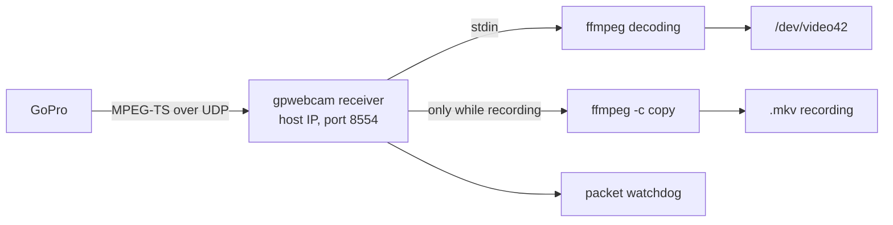

# Tray icon and recording (0.2.0)

- **Status:** Accepted 2026-10-06: tray through `fyne.io/systray`, since 2026-10-06 from the fork `darkodemic/systray`, since 2026-10-07 as its own module `github.com/darkodemic/systray` v1.13.0 (§3.2, §10), in the same process as `gpwebcam run` (§3), slices in order: tray, own UDP receiver, recording (§7). The target is release 0.2.0.
- **Date:** 2026-10-06
- **Owner:** Darko
- **Related:** `release-0.1.0.md` §2 (F3), §4; handover note §10.1 (notifications), §10.2 (recording); `first-slice-gw-start.md` §8 (packet watchdog); ADR 0001 (Go as the implementation language); ADR 0003 (gpwebcam owns the device as a user service)

## 1. Scope

Darko's proposal of 2026-10-06: while the service runs, an icon sits in the system tray. It is used to set the webcam mode and to start recording. Anyone who does not want the icon can turn it off.

In scope:

- a tray icon with a menu and the camera state;
- settings from the menu that are remembered between runs;
- recording of the camera's H.264 stream to a file, without re-encoding (F3 from `release-0.1.0.md`).

Out of scope for 0.2.0: a settings window, recording to the camera's microSD card, audio (webcam mode has none), multiple cameras.

## 2. Verified

| Fact | Source |
|---|---|
| Quickshell on the test machine is the tray host and watcher (`org.kde.StatusNotifierWatcher`), with several icons of other applications registered | `busctl --user`, 2026-10-06 |
| GNOME without the AppIndicator extension does not show StatusNotifierItem icons; Ubuntu has it enabled, Fedora does not | common knowledge, not verified in a container |
| The user service has `DBUS_SESSION_BUS_ADDRESS` (`unix:path=/run/user/1000/bus`) and `XDG_RUNTIME_DIR` | `systemctl --user show-environment`, 2026-10-06 |
| The frame size in `/dev/video42` is set once, when `gpwebcam run` starts, from `-res`; the placeholder and the stream are scaled to it | `cmd/gpwebcam/serve.go:132`, `internal/stream/stream.go:119` |
| ffmpeg itself listens for UDP on the host's IP address on the GoPro interface; the camera sends unicast to one port | `internal/stream/stream.go:84`; handover note §2 |
| The unit has `ProtectHome=read-only` and `ProtectSystem=strict`, so the service currently cannot write to the home directory | `packaging/systemd/gpwebcam.service` |
| `xdg-user-dir VIDEOS` on the test machine returns the home folder, because the XDG videos folder is not set | 2026-10-06 |
| `fyne.io/systray` v1.12.2 requires Go 1.19 and depends on `godbus/dbus/v5` and `golang.org/x/sys`; `godbus/dbus/v5` v5.2.2 requires Go 1.20. Both fit `go 1.22` in `go.mod` | proxy.golang.org, 2026-10-06 |
| `fyne.io/systray` v1.12.2: cgo only in `systray_darwin.go`; the Linux part (`systray_unix.go`) is pure Go over D-Bus. It watches `NameOwnerChanged` for `org.kde.StatusNotifierWatcher` and registers again when the watcher appears. It has `RunWithExternalLoop` for a program that already has its own loop. It keeps its state in a global variable and writes errors through the standard `log` | source code of v1.12.2 from proxy.golang.org, 2026-10-06 |
| `fyne.io/systray` has no radio items, neither in v1.12.2 nor on `master` (`528cad2`): on Linux it sends only the dbusmenu `toggle-type` `checkmark`, although the spec also has `radio`. There is no issue or PR for it, in either `fyne-io/systray` or `getlantern/systray` | source code and `gh search`, 2026-10-06 |
| `fyne-io/systray` is a GitHub fork of `getlantern/systray`: 186 commits ahead, 17 behind. Those 17 are from 2021–2023, mostly GTK and libayatana-appindicator, which fyne removed on purpose, plus two Windows fixes for submenus. `getlantern/systray` last changed on 2024-07-03, `fyne-io/systray` in 2026-08 | GitHub compare API, 2026-10-06 |

## 3. Tray

### 3.1 Process

Decided 2026-10-06: the tray runs in the same process as `gpwebcam run`. That way there is no second service and no communication between processes, and the menu changes the session state directly. D-Bus needs only the session bus, not a display, so it also works from a user service.

The alternative is a separate process `gpwebcam tray` with its own user service, which sends commands to the service over a Unix socket. The advantages are that a tray crash does not bring down the webcam, and that the main service stays free of external dependencies. The disadvantages are two services that the user has to enable, and a protocol between them.

### 3.2 Library

Decided 2026-10-06 (Darko): `fyne.io/systray`.

Amended 2026-10-06 (Darko): gpwebcam uses the fork [darkodemic/systray](https://github.com/darkodemic/systray) through `replace` in `go.mod`. Development of the library continues in the fork; changes that are useful to others also go as a PR to `fyne-io/systray`. The reason is full control over the library, so radio items (§9) do not wait for an upstream release.

- A branch in the fork is named after the change, not after gpwebcam (Darko, 2026-10-06): radio items are on `radio-menu-items`, and the next changes go on branches like `feat/<change>`.
- The fork's `master` is our line (Darko, 2026-10-06): changes are merged into it, and `replace` points to a commit from it. A branch for a PR to `fyne-io/systray` is created from their `master`, so that it does not carry our other changes. `radio-menu-items` was fast-forwarded into the fork's `master` (`9c45f67`). In the local clone `~/Projects/systray`, `origin` is the fork and `upstream` is `fyne-io/systray`.
- `replace` instead of renaming the module to `github.com/darkodemic/systray`: imports stay `fyne.io/systray`, and going back to upstream means deleting one line. No longer valid since 2026-10-07: the fork is renamed and released (§10).
- Consequences: `go install …@latest` does not work when `go.mod` has a `replace` (the README does not offer it); the Debian archive (`packaging-and-release.md` §6, step 4) does not accept a dependency from a fork, so before the ITP we need either an upstream release or a renamed module with tags; Dependabot only reports upstream releases of `fyne.io/systray`, and the fork is updated by hand.

The Go standard library has no D-Bus, so this is the first external dependency (ADR 0001 says "standard library first", not "only").

| Option | For | Against |
|---|---|---|
| `fyne.io/systray` | ready-made StatusNotifierItem and dbusmenu; on Linux without GTK and cgo, so the binary stays static; registers again by itself (§2) | two dependencies (`systray`, `godbus`); global state and the standard `log` instead of `slog` |
| our own StatusNotifierItem and dbusmenu on `godbus/dbus/v5` | one dependency; full control over re-registration and icons | several hundred more lines of code and tests |
| our own minimal D-Bus client | zero dependencies | too much work for this benefit |

### 3.3 Menu

Only a menu, no window: a window needs a GUI library, and that is a much larger dependency than D-Bus.

- state, a disabled item: for example "HERO13 Black · 1080p · linear · stream running"
- Record / Stop recording, with the duration while recording
- Open recordings folder (`xdg-open`)
- Field of view: wide, narrow, superview, linear (radio)
- Resolution: 1080p, 720p (radio)
- Hardware decoding (checkbox)
- Notifications (checkbox)
- Hide icon

The icon shows the state. As Darko asked on 2026-10-06 (`camera-on-demand.md` §4): white while video flows, orange when there is a problem, faded white otherwise; while recording, it gets a red dot.

### 3.4 Turning the icon off

- `-tray=false` in the unit (`systemctl --user edit gpwebcam.service`) turns the tray off.
- "Hide icon" in the menu writes this to the settings (§4). The icon comes back through the settings or the flag, and the README describes this.
- When there is no tray host (GNOME without the extension, login over SSH), the service runs as before, without an error.

### 3.5 A tray host that comes later

At login the service can start before Quickshell or the panel, and the panel can also restart. So the icon watches for `org.kde.StatusNotifierWatcher` to appear on the bus and then registers again. `fyne.io/systray` does this by itself (§2); our own implementation would have to do the same.

## 4. Settings

- Choices from the menu are saved in `~/.config/gpwebcam/` (`$XDG_CONFIG_HOME`). The format is still open; JSON from the standard library is the simplest.
- A flag in the unit takes precedence over the file. That item is then locked in the menu, with a note that it is set in the service.
- The field of view changes live: the session sends stop, then START with the new FOV. The camera comes back in about 4 s, and during that time the placeholder is shown. An application that uses the camera notices nothing except the break in the picture.
- The resolution does not change live. An application takes the device format when it opens the camera, so a change mid-use would break the picture in Zoom. The new resolution applies at the next start of the service, or when no application uses the device. How to know reliably that nobody uses it needs research; until then it applies after a service restart, with a message in the menu.

## 5. Recording

### 5.1 Receiving the stream

The camera sends the stream to one UDP port, so recording has to use the same receiver as the webcam.

| Option | For | Against |
|---|---|---|
| A: ffmpeg restarts with another output (a copy to a file) | small change | the webcam picture disappears for 1 to 2 s at every start and stop of recording |
| B: `gpwebcam` itself receives UDP and sends the packets to ffmpeg for the webcam and, while recording, to the recorder | recording without a break in the picture; the packet watchdog from `first-slice-gw-start.md` §8 comes along for free | changes the path that was tuned to 0.18 s of latency; has to be measured again |

Decided: B, done 2026-10-06 (slice 2, §9). The rule to listen only on the host's IP address on the GoPro interface stays (`net.ListenUDP` on that address), and datagrams are now also accepted only from the camera's address.

### 5.2 File

- `-map 0:v:0 -c copy`: video only, without re-encoding; the CPU is almost idle.
- Matroska (`.mkv`), because it stays readable even when an unplugged cable cuts the recording short (handover note §10.2).
- Folder: decided 2026-10-07 (Darko), always `~/Videos/gpwebcam`, because the unit allows writing only to `~/Videos` (§6). A different folder: the `-record-dir` flag together with a drop-in that sets `ReadWritePaths`. The original proposal with `$XDG_VIDEOS_DIR` was rejected: on the test machine the XDG videos folder is not set, and a localized folder would have to be allowed separately in the unit anyway. The file name comes from the start time, for example `GoPro-2026-10-06-135012.mkv`; the same time gets `-2`, `-3`.
- About 6 Mb/s, about 2.7 GB per hour. No audio.
- Unplugging the cable or stopping the service ends the recording, and the file stays valid. When the camera comes back, recording does not resume by itself; the user starts it again.

### 5.3 Without the tray

Anyone without a tray records with the command `gpwebcam record start|stop`. The command talks to the service over a Unix socket in `$XDG_RUNTIME_DIR/gpwebcam/` (HTTP through `net/http`, standard library). Decided 2026-10-06 (Darko): it goes into 0.2.0.

## 6. Unit and sandbox

- The service has to write to the recordings folder and to `~/.config/gpwebcam/`. `ConfigurationDirectory=gpwebcam` gives write access to `~/.config/gpwebcam` despite `ProtectHome=read-only` (verified 2026-10-06, §9).
- For recordings, decided 2026-10-07 (Darko): `ReadWritePaths=-%h/Videos`, and `ProtectHome=read-only` stays. "-" means the unit does not fail when the folder does not exist (verified 2026-10-07 with a temporary user unit); recording then fails, with a message. The other option, a setup with any folder and without `ProtectHome`, was rejected because the service and ffmpeg would be allowed to write anywhere in the home directory.
- Control socket: `RuntimeDirectory=gpwebcam` provides `/run/user/<uid>/gpwebcam`, which the service may write to, while the rest of `/run/user/<uid>` is read-only under `ProtectSystem=strict` (verified 2026-10-07).
- The recordings folder is opened by the file manager through `org.freedesktop.FileManager1.ShowFolders` on the session D-Bus. A process started from the service (`xdg-open`) would share its sandbox, including the read-only home directory; D-Bus activation starts the file manager outside it.
- `RestrictAddressFamilies` already allows `AF_UNIX`, so D-Bus and the control socket work without changes.

## 7. Slices

Order decided 2026-10-06 (Darko):

1. Settings in a file, and a tray menu with field of view, resolution, hardware decoding, notifications and hiding. Does not touch the stream path.
2. Own UDP receiver (§5.1, option B), latency measurement and the packet watchdog.
3. Recording: a menu item and, depending on the decision, `gpwebcam record`.

With every slice: README, man page, `doctor` (tray host, recordings folder), and CONTRIBUTING when the package layout changes.

## 8. Test plan

- Tray on Quickshell: the icon appears; after a Quickshell restart it comes back; the menu changes the FOV live, and Zoom stays connected.
- Without a tray host (container, SSH): the service runs and does not log errors in a loop.
- Latency with the own receiver versus 0.18 s before the change, with the same method as in `second-slice-gw-run.md` §4.
- Recording: start and stop from the menu; a cable pulled mid-recording leaves a file that plays; recording does not break the picture in Zoom.
- Packages: the unit with the new `ReadWritePaths` on all four distributions in containers.

## 9. Where we are and what is next

- 2026-10-06: Darko's proposal, the checks in §2 and this plan. Darko accepted the tray in the same process, `fyne.io/systray` and the order of the slices.
- 2026-10-06, slice 1 written (tests pass with `-race`, also on Go 1.22):
  - `internal/settings`: JSON in `~/.config/gpwebcam/settings.json` (`$CONFIGURATION_DIRECTORY`, then `$XDG_CONFIG_HOME`); the file may contain only the changed keys; an unknown key or value is an error, and the service then keeps the default or the last valid values.
  - `gpwebcam config [<setting> [<value>]]`; the service checks the file every 2 s and applies a change. A flag given on the command line takes precedence and locks the item in the menu.
  - A change of FOV or decoder interrupts the session (`errReconfigured`), and the loop starts a new one right away. The session registers for interruption before it reads the settings. The resolution is saved and applies after a restart.
  - `internal/tray`: the menu from §3.3 without the recording items; the icon is drawn in code (64x64, gray, blue, orange).
  - `doctor`: a check of the settings file and of the tray host (`NameHasOwner` for `org.kde.StatusNotifierWatcher` through `godbus`).
  - Unit: `ConfigurationDirectory=gpwebcam`. Verified with a temporary user unit (`systemd-run --user`): with it, writing to `~/.config/gpwebcam` works despite `ProtectHome=read-only`; without it, "Read-only file system"; and systemd sets `CONFIGURATION_DIRECTORY`.
  - A temporary demo program on Quickshell: the icon registers and disappears, starts again in the same process (hide, then `config tray on` works without a restart), the tooltip and the menu change, and clicks sent through `com.canonical.dbusmenu.Event` reach the settings.
  - v4l2loopback 0.15.4 (`vidioc_try_fmt_vid`): while a reader holds the format, a writer gets the old format on `S_FMT`, without an error. So a live resolution change is not safe; `OpenOutput` does not even check the returned format.
  - The binary is still static, 9.2 MB instead of 7.1 MB (D-Bus and tray). Dependabot now also tracks Go modules.
- 2026-10-06: commit `b68f9e7`, CI green. Darko installed the snapshot package; `gpwebcam config res 720`, then a service restart: device `YU12:1280x720@30`, icon registered with Quickshell, `doctor` reports no problems. With the camera: at first HTTP 500 with error 4 (Shutter) on every START, because the camera had no battery (handover note §2); with the battery, 720p, linear and VAAPI work, video 4.5 s after plugging in.
- Found along the way, fixes waiting for Darko's decision: (1) `v4l2.OpenOutput` does not check the format the driver accepted, so a start in a different resolution while an application holds the device would give a broken picture; the proposal is that the service continues in the size the device has, and the new resolution waits for the next restart. (2) Error 4 is shown as a generic "Camera problem"; the proposal is a dedicated message on the placeholder and in the notification (battery, then turning the camera off).
- 2026-10-06, test from the menu with the camera (720p), Darko: "everything works". From the log, from the click to "video is flowing":

  | Change | Time |
  |---|---|
  | FOV wide | 5.8 s |
  | FOV superview | about 20 s: START 2.3 s after STOP returned error 4; the next START reported a stream without video, then stop and START after 3 s and the watchdog after 6 s; picture in the third session |
  | FOV narrow | 5.5 s |
  | FOV linear | 5.5 s |
  | hwdec none | 5.4 s |
  | hwdec auto | 5.7 s |

  Hide icon at 21:29:58, `gpwebcam config tray on` at 21:30:05: the icon registered again without a service restart. At every start with VAAPI, ffmpeg writes three lines "hardware accelerator failed to decode picture" before the first frame; they are also in the log of the builds from 2026-10-05, so they are not new.
- Idea after the superview case: when START returns error 4, repeat START after about 1 s in the same session, instead of ending the session and waiting for `retryDelay`.
- 2026-10-06: Darko approved fixes (1) and (2), and the repeated START after error 4 "if you can handle it on your own". Done (tests pass with `-race`, also on Go 1.22):
  - `v4l2.OpenOutput` reads the format that `S_FMT` returned. A different pixel format is an error; a different size is accepted. The service then continues in that size, asks the camera for the resolution of that size (`camera.ResolutionFor`), writes a warning to the log and sends a notification, and the tray shows that the new resolution waits for a restart. Confirmed in v4l2loopback 0.15.4 (`vidioc_s_fmt_vid`): the writer gets the OUTPUT token and the old format, without `EBUSY`.
  - `camera.ErrCannotCapture` for error 4, also when it arrives as HTTP 500 with a JSON body (HERO13). `StartWebcam` sends START up to 3 times, 1 s apart, while the camera returns error 4; after that the session ends, the placeholder says "Camera cannot start. Is its battery in and charged?", and the notification suggests checking the battery and turning the camera off. Whether the repeated START helps in the battery case is not verified, because that case cannot be caused on purpose; a test with a fake camera covers both outcomes.
  - The placeholder test now checks that every message fits in the picture. The first attempt (`leftmost <= 0`) would not catch anything: a line of 120 characters starts at column 3, because ffmpeg cuts off letters at the edge; now a margin of 1/20 of the width is required. The new message starts at 131 px of 640, "Camera not answering…" at 122.
- 2026-10-06, fix (1) live: an ffmpeg reader (`-f v4l2 -i /dev/video42`) holds the device at 720p; the service is stopped, the reader stays; a build from the working tree with `-res 1080` writes "an application keeps the device at its size" (`size=1280x720 wanted=1920x1080`), the device stays `YU12:1280x720`, the camera starts in 720p and video flows within 4.2 s. Along the way: an ffmpeg reader whose writer has gone does not react to SIGTERM, only to SIGKILL; because of that the webcam was down for about 2 min during the test.
- 2026-10-06: commit `8fb1ca7`, CI green.
- 2026-10-06: Darko asked about a restart from the menu and a camera that runs only when an application asks for it; the proposal is `camera-on-demand.md`. The icon changed: white, orange and faded white instead of gray, blue and orange.
- 2026-10-06: Darko decided that camera on demand (`camera-on-demand.md`) goes before slice 2.
- 2026-10-06: Darko noticed that camera, field of view and resolution in the menu have checkboxes although a single value is chosen, because the library has no radio items (§2). Agreed: add them to `fyne.io/systray` and send a PR. Done in the local clone `~/Projects/systray` (from `master` `528cad2`), commit `9c45f67` on the branch `radio-menu-items` of the fork `darkodemic/systray`, PR [fyne-io/systray#135](https://github.com/fyne-io/systray/pull/135) (closed 2026-10-06, when its branch was deleted; Darko does not reopen it: "ako hoće mogu sami da povuku izmene", "if they want, they can pull the changes themselves"):
  - `AddMenuItemRadio` and `AddSubMenuItemRadio`, with the same `Check`/`Uncheck` as a checkbox; the application keeps the group exclusive, as it already did in `show`. Linux and BSD: `toggle-type` `radio`; Windows: `MFT_RADIOCHECK`; macOS unchanged, because there a single-value choice also carries a check mark.
  - A test for `toggle-type` and `toggle-state`, a "Size" group in the example, README. Tests pass, the Windows build passes; the example run on Quickshell returns `toggle-type` `radio` through `GetLayout`. The Windows test file does not compile on upstream `master` even without this change (`systray_windows_test.go:47`, old signature).
  - gpwebcam: three calls in `internal/tray/tray.go` switched to `AddSubMenuItemRadio`.
- 2026-10-06: Darko decided that gpwebcam moves to the fork (§3.2). `go.mod`: `replace fyne.io/systray => github.com/darkodemic/systray v1.12.3-0.20261006205618-9c45f672f861`, commit `9c45f67` from the branch `radio-menu-items`. Verified without `go.work`: `gofmt`, `go vet` and `go test -race` pass on Go 1.27.1 and 1.22.12; `goreleaser release --snapshot --clean` builds all six packages; the binary is still static, and `go version -m` shows the fork.
- 2026-10-06: camera on demand finished (`camera-on-demand.md`, commits `2a23480` and `cf385e9`).
- 2026-10-06, slice 2 written in the worktree `.worktrees/receive-udp`, branch `feat/receive-udp-in-gpwebcam` (tests pass with `-race`, also on a real Go 1.22):
  - `internal/stream/receive.go`: `net.ListenUDP` on the host's address, only datagrams from the camera's address (others are counted as foreign); a queue of 2048 datagrams (about 3.5 s) between the socket and ffmpeg's stdin, so a slow ffmpeg does not block the socket; instead the excess is dropped and counted, like `overrun_nonfatal` before.
  - ffmpeg reads `-f mpegts -i pipe:0` and no longer opens a socket. The packet watchdog is now in gpwebcam: `ReadTimeout` from the last datagram, and before the first one `FirstFrame` applies.
  - Errors: `ErrNoPackets` (no datagram at all, probably a firewall or VPN) and `ErrNoVideo` with the datagram count when datagrams arrive but ffmpeg decodes nothing. The firewall hint on the placeholder now comes only with `ErrNoPackets`. The counters (received, dropped, foreign) go to the log when something is missing.
  - An ffmpeg that waits on the pipe does not react to SIGTERM; cancellation now first closes its stdin, so ffmpeg exits right away (cancellation test: 0.3 s instead of 2.3 s, that is, instead of `grace`).
  - Latency, new test `TestLatency` (`GPWEBCAM_LATENCY=1`): local libx264 640x360 30 fps, the frame number written into the pixels, the send time from `showinfo`; 390 frames per measurement. Old path (ffmpeg listens on UDP, `main` `cf385e9`): median 134 ms in software, 135 ms with VAAPI; new: 134 ms and 135 ms; p90 135 and 136 ms in both. The own receiver adds no latency. The constant of about 134 ms (4 frames) is in the sender and decoder path, the same for both versions; so the test compares the versions and does not measure the camera's latency.
- 2026-10-06: live test: video 4.1 s after switching on, no foreign and no dropped datagrams, so the camera sends from its own address. Darko installed the package and tried it with Zoom. Commit `b1acb92`, CI green.
- 2026-10-07, slice 3 written in the worktree `.worktrees/recording`, branch `feat/recording` (tests pass with `-race`, also on a real Go 1.22):
  - `stream.Config.OnPacket` gives the recorder the same datagrams the decoder gets, without copying; each datagram has its own slice that nobody modifies.
  - `internal/record`: a second ffmpeg, `-f mpegts -i pipe:0 -map 0:v:0 -c copy -f matroska`, its own queue of 2048 datagrams (the excess is dropped and counted), the process on a locked thread because of `Pdeathsig`. The file is created in advance with `O_EXCL`, and ffmpeg then overwrites it. At least 1 GB of free space is required. Test: a TS with a video and an audio stream is cut into datagrams, and `ffprobe` confirms a Matroska file with only a video stream of about 3 s.
  - Service: recording stays on until the user turns it off, and a file lasts as long as the session; a new session (a change of FOV or decoder) opens a new file. Recording keeps the camera on, also in demand mode. An unplugged cable and off mode end the recording, and it does not resume by itself. When ffmpeg stops on its own (full disk), recording is turned off with a notification.
  - Control API: `GET /v1/status`, `POST /v1/record/start`, `POST /v1/record/stop`, socket 0600; `gpwebcam record [start|stop]` waits up to 20 s for the file to open, because in demand mode the camera first has to start.
  - Tray: Record, Stop recording with the time (refreshed every second), Open recordings folder; a red dot on the icon while recording.
  - `doctor` checks `~/Videos` and the free space.
- 2026-10-07, live test (build from the worktree, recordings into the scratchpad, 720p, demand mode): `gpwebcam record start` while the camera is idle starts the camera, and the file opens within 2.4 s; a FOV change during recording keeps the first file and opens a second one; `record stop` prints the file, the duration and the size. `ffprobe`: both files are Matroska with one H.264 1280x720 stream, 7.0 s and 3.5 s (when copying, ffmpeg drops the initial frames up to the first keyframe). Writing to `~/Videos` from the service sandbox is left for the test with the package.
- 2026-10-07, Darko's test of a package from the working tree: Record and Stop from the menu, recording in 1080p after a resolution change, and opening the folder work from the service sandbox (`~/Videos/gpwebcam`, `ReadWritePaths=-%h/Videos`). Two fixes:
  - The size in the notification: "8 MB" for a file that Nautilus shows as 9.2 MB. The bytes were correct (`bytes=9165466` in the log, the same as `ls`), but they were shown as MiB (`>>20`), without decimals. Now `record.SizeText` computes in decimal units with one decimal place, like Nautilus and Dolphin, in the notification, in `gpwebcam record stop` and in the free-space messages; the threshold is exactly 1 GB.
  - The first recording fell on a session in which the camera reported a stream, but only 49 datagrams arrived, without a single frame, so a 52 kB file without a picture was left behind. The recorder now starts with the first decoded frame, not at the start of the session, so a session without video leaves no file.
- 2026-10-07: Darko proposed "Quit gpwebcam" at the bottom of the menu and a launcher in the applications menu, so the service can be brought back without a terminal; both were agreed. Quit stops the service through systemd (`GetUnitByPID`, then `Unit.Stop`), so systemd does not start it again; without systemd it just ends the process cleanly. The notification is sent synchronously (`notify.SendNow`), before the process goes away. Launcher: `packaging/desktop/gpwebcam.desktop` in `/usr/share/applications`, "GoPro Webcam", the icon `camera-web` from the theme until Darko makes his own; it runs `gpwebcam launch`, which starts the service through `Manager.StartUnit`, waits for it to become active and reports the outcome with a notification, because there is no terminal when started from the menu. `desktop-file-validate` reports nothing; `gpwebcam launch` while the service runs says "already running".
- 2026-10-07: slice 3 committed together with Quit and the launcher (`ccabf7f`), CI green. The plans were translated into English, personal details of the test machine were removed from the whole history, and the rewritten history went to a new public repository `darkodemic/gpwebcam`; the old one stays private as `darkodemic/gpwebcam-private-archive`. `v0.1.0` published.
- 2026-10-07: gpwebcam moves to `github.com/darkodemic/systray` v1.13.0 (§10).
- Next: release 0.2.0.

## 10. Amendments

### 2026-10-07: the systray fork as its own module

The fork is renamed from `fyne.io/systray` to `github.com/darkodemic/systray` (fork PR #4, decision in the fork's `docs/plans-and-decisions/0001-module-path.md`) and has its first release, v1.13.0, a signed annotated tag. It works the same as `9c45f67`, which gpwebcam used through `replace`, except that godbus is raised to v5.2.2.

- `go.mod`: `require github.com/darkodemic/systray v1.13.0` and `github.com/godbus/dbus/v5 v5.2.2`, indirect `golang.org/x/sys v0.27.0`, `go 1.22`, no `replace`. The import in `internal/tray/tray.go` is `github.com/darkodemic/systray`; the package is still called `systray`.
- §3.2, "`replace` instead of renaming the module", no longer applies.
- Consequences: `go install …@latest` is no longer blocked by `replace`. Dependabot now opens pull requests for new releases of the fork, so updating it by hand is no longer needed. For a Debian ITP (`packaging-and-release.md` §6, step 4) there is now a renamed module with tags, but it would have to exist as a Debian package of its own, like any Go dependency; `fyne.io/systray` is not in Debian either. godbus is in Debian as `golang-dbus` 5.1.0 (bookworm, trixie, forky and sid, checked 2026-10-07 on sources.debian.org), so either gpwebcam builds with 5.1.0 there or `golang-dbus` needs an update.
- Upstream PR fyne-io/systray#135 (radio items) was closed 2026-10-06, when its branch was deleted. Darko does not reopen it.
